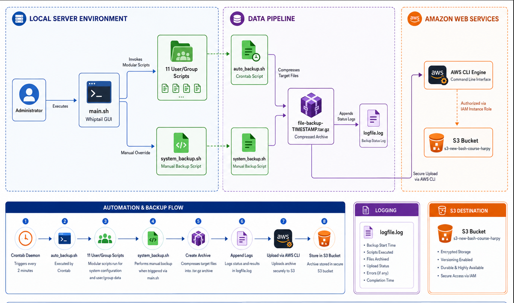
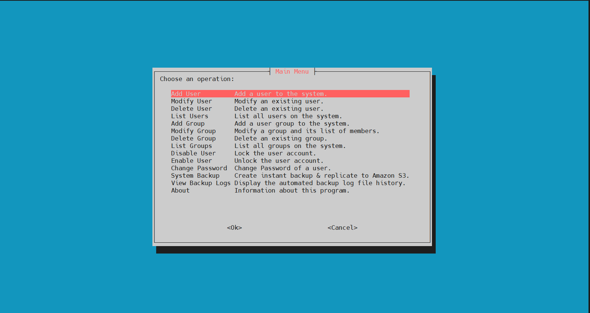
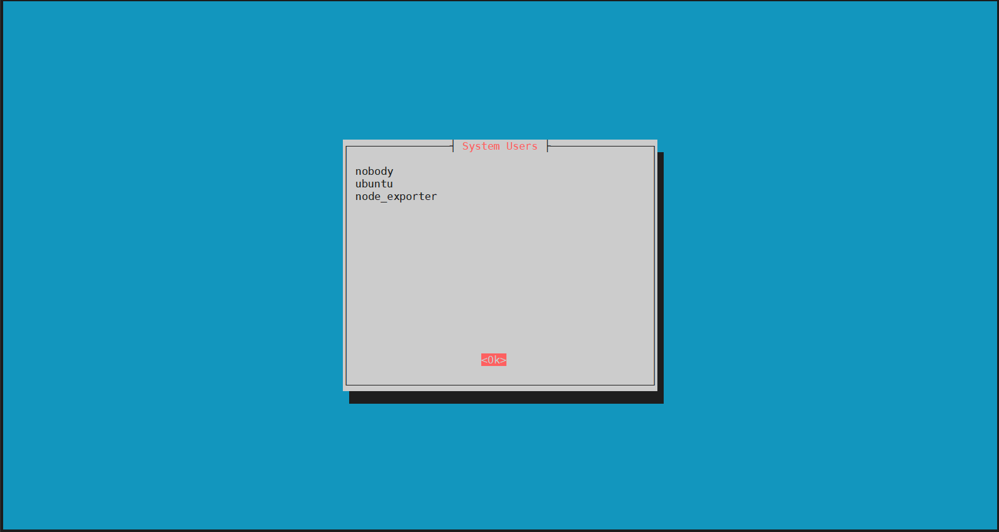
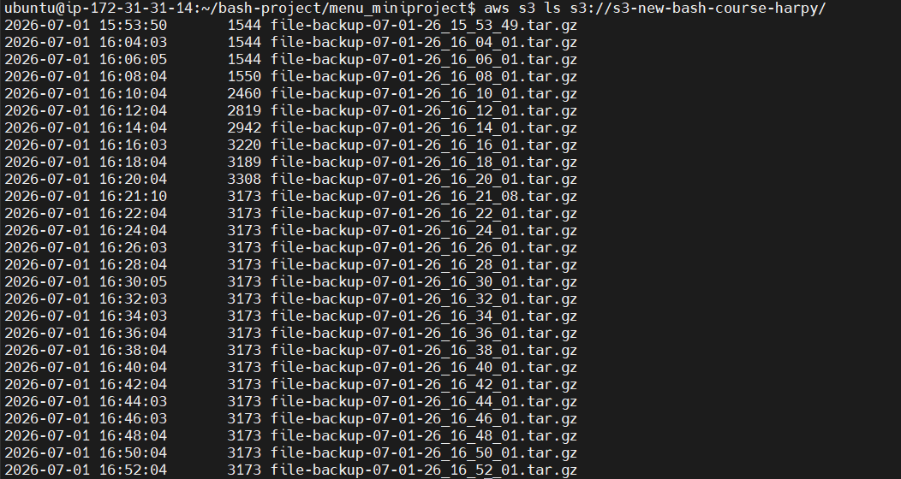
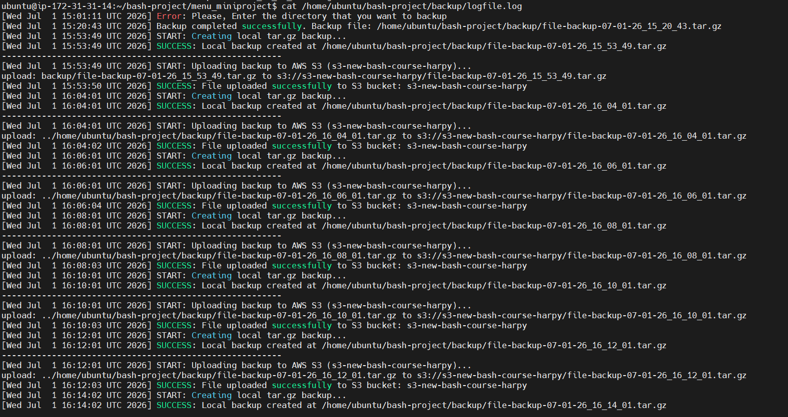
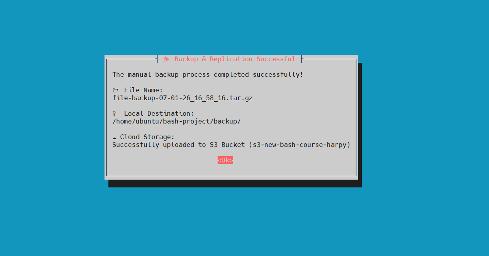
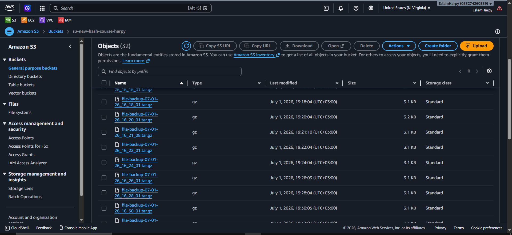

# 🚀 Unified Cloud Management: User Governance & Automated VM Replication

<p align="left">
  
  
  
  
  
</p>

---

## 🗺️ System Architecture Overview

This suite delivers a highly resilient, enterprise-grade infrastructure management framework. It seamlessly unifies **Interactive System Administration** with an **Automated Disaster Recovery Engine** integrated directly into the AWS Cloud ecosystem. 

<p align="center">
  
  <br>
  <em><b>Figure 1:</b> System Architecture Diagram </em>
</p>

### Architectural Pillars:

1. **Decoupled Modular Design:** Every administrative option is entirely isolated into its own dedicated sub-script, mitigating system blast radius during updates.
2. **Interactive TUI Management:** Uses `whiptail` to construct clean terminal-based modal views, minimizing manual script argument errors.
3. **Automated & Zero-Credential Cloud Replication:** Rather than storing high-risk permanent AWS Access Keys locally on the EC2 instance, authorization is dynamically handled using a securely attached **IAM Instance Profile Role**.

---

## 🛠️ Enterprise Tooling & Stack

| Component / Tool | Sub-Component | Purpose in Architecture |
| --- | --- | --- |
| **Operating System** | Ubuntu Server 24.04 LTS / RHEL | Host server for deployment environment |
| **Interface Engine** | `whiptail` (Newt System) | Renders dialog boxes, input configurations, and status frames |
| **Cloud Framework** | AWS CLI v2 | Enables unified terminal interactions with Amazon S3 APIs |
| **Security Layer** | AWS IAM Role Policy | Provides short-term, rotating access tokens to the local host |
| **Data Compression** | GNU `tar` (`-czf`) | Packs active project codes and assets into standard `.tar.gz` |
| **Scheduling Engine** | ISC Cron Daemon (`/etc/crontab`) | Drives persistent background sync execution loops |

---

## 📂 File & Directory Structure

The production stack is organized within a structured folder hierarchy to separate the frontend interactive controls from persistent tracking states:

```text
/home/ubuntu/bash-project/
├── auto_backup.sh                 # Background system automation loop script
├── backup/                        # Persistent Storage Target
│   └── logfile.log                # Central Monitoring & Tracing Log File
└── menu_miniproject/              # Core Administrative TUI Application
    ├── main.sh                    # Orchestrator & UI Core Engine
    ├── add_user.sh                # Independent user creation module
    ├── modify_user.sh             # Independent user shell reconfiguration module
    ├── delete_user.sh             # Independent user profile cleanup module
    ├── list_users.sh              # Standard user catalog scanner
    ├── add_group.sh               # Independent group directory allocation module
    ├── modify_group.sh            # Independent group membership modifier
    ├── delete_group.sh            # Independent group lifecycle removal module
    ├── list_groups.sh             # Target group lookup matrix
    ├── disable_user.sh            # Target account locking security interface
    ├── enable_user.sh             # Target account reactivation security interface
    ├── change_password.sh         # Dynamic terminal password replacement engine
    └── system_backup.sh           # Manual UI cloud synchronization entry point

```

---

## 🔷 Part 1: Interactive User & Group Management App

### Functional Requirements

* Implement an intuitive terminal navigation interface with clear descriptions.
* Abstract complex Linux terminal commands (`useradd`, `usermod`, `groupadd`, `awk`) behind automated input windows.
* Keep scripts completely decoupled to prioritize system extendability.

### 📜 Script Implementations

#### 1. Core Wrapper & Orchestrator (`main.sh`)

```bash
#!/bin/bash
SCRIPT_DIR="$(cd "$(dirname "${BASH_SOURCE[0]}")" && pwd)"
LOG_FILE="/home/ubuntu/bash-project/backup/logfile.log"

while true; do
    CHOICE=$(whiptail --title "Main Menu" --menu "Choose an operation:" 24 75 14 \
        "Add User" "Add a user to the system." \
        "Modify User" "Modify an existing user." \
        "Delete User" "Delete an existing user." \
        "List Users" "List all users on the system." \
        "Add Group" "Add a user group to the system." \
        "Modify Group" "Modify a group and its list of members." \
        "Delete Group" "Delete an existing group." \
        "List Groups" "List all groups on the system." \
        "Disable User" "Lock the user account." \
        "Enable User" "Unlock the user account." \
        "Change Password" "Change Password of a user." \
        "System Backup" "Create instant backup & replicate to Amazon S3." \
        "View Backup Logs" "Display the automated backup log file history." \
        "About" "Information about this program." \
        3>&1 1>&2 2>&3)

    if [ $? -ne 0 ]; then
        clear
        echo "Exiting program..."
        break
    fi

    case "$CHOICE" in
        "Add User") "$SCRIPT_DIR/add_user.sh" ;;
        "Modify User") "$SCRIPT_DIR/modify_user.sh" ;;
        "Delete User") "$SCRIPT_DIR/delete_user.sh" ;;
        "List Users") "$SCRIPT_DIR/list_users.sh" ;;
        "Add Group") "$SCRIPT_DIR/add_group.sh" ;;
        "Modify Group") "$SCRIPT_DIR/modify_group.sh" ;;
        "Delete Group") "$SCRIPT_DIR/delete_group.sh" ;;
        "List Groups") "$SCRIPT_DIR/list_groups.sh" ;;
        "Disable User") "$SCRIPT_DIR/disable_user.sh" ;;
        "Enable User") "$SCRIPT_DIR/enable_user.sh" ;;
        "Change Password")
            clear
            "$SCRIPT_DIR/change_password.sh"
            echo "Press Enter to return to main menu..."
            read
            ;;
        "System Backup") "$SCRIPT_DIR/system_backup.sh" ;;
        "View Backup Logs")
            if [ -f "$LOG_FILE" ]; then
                LATEST_LOGS=$(tail -n 20 "$LOG_FILE")
                whiptail --title "Latest Backup Logs" --msgbox "$LATEST_LOGS" 22 70
            else
                whiptail --title "Error" --msgbox "Log file not found yet!" 10 45
            fi
            ;;
        "About") whiptail --title "About" --msgbox "Advanced User Management & Cloud Automation System v2.0" 12 60 ;;
    esac
done

```

#### 2. `add_user.sh`

```bash
#!/bin/bash
USERNAME=$(whiptail --inputbox "Enter the new username:" 8 45 3>&1 1>&2 2>&3)
if [ ! -z "$USERNAME" ]; then
    sudo useradd "$USERNAME" && whiptail --msgbox "User $USERNAME added successfully!" 8 45
fi

```

#### 3. `modify_user.sh`

```bash
#!/bin/bash
USERNAME=$(whiptail --inputbox "Enter username to modify:" 8 45 3>&1 1>&2 2>&3)
if [ ! -z "$USERNAME" ]; then
    NEW_SHELL=$(whiptail --inputbox "Enter new shell (e.g., /bin/bash):" 8 45 3>&1 1>&2 2>&3)
    if [ ! -z "$NEW_SHELL" ]; then
        sudo usermod -s "$NEW_SHELL" "$USERNAME" && whiptail --msgbox "User $USERNAME modified successfully!" 8 45
    fi
fi

```

#### 4. `delete_user.sh`

```bash
#!/bin/bash
USERNAME=$(whiptail --inputbox "Enter username to delete:" 8 45 3>&1 1>&2 2>&3)
if [ ! -z "$USERNAME" ]; then
    sudo userdel -r "$USERNAME" && whiptail --msgbox "User $USERNAME deleted!" 8 45
fi

```

#### 5. `list_users.sh`

```bash
#!/bin/bash
USERS_LIST=$(awk -F: '$3 >= 1000 {print $1}' /etc/passwd)
whiptail --title "System Users" --msgbox "$USERS_LIST" 20 50

```

#### 6. `add_group.sh`

```bash
#!/bin/bash
GROUPNAME=$(whiptail --inputbox "Enter the new group name:" 8 45 3>&1 1>&2 2>&3)
if [ ! -z "$GROUPNAME" ]; then
    sudo groupadd "$GROUPNAME" && whiptail --msgbox "Group $GROUPNAME created successfully!" 8 45
fi

```

#### 7. `modify_group.sh`

```bash
#!/bin/bash
GROUPNAME=$(whiptail --inputbox "Enter group name to modify:" 8 45 3>&1 1>&2 2>&3)
if [ ! -z "$GROUPNAME" ]; then
    USERNAME=$(whiptail --inputbox "Enter username to add to this group:" 8 45 3>&1 1>&2 2>&3)
    if [ ! -z "$USERNAME" ]; then
        sudo usermod -aG "$GROUPNAME" "$USERNAME" && whiptail --msgbox "User $USERNAME added to $GROUPNAME!" 8 45
    fi
fi

```

#### 8. `delete_group.sh`

```bash
#!/bin/bash
GROUPNAME=$(whiptail --inputbox "Enter group name to delete:" 8 45 3>&1 1>&2 2>&3)
if [ ! -z "$GROUPNAME" ]; then
    sudo groupdel "$GROUPNAME" && whiptail --msgbox "Group $GROUPNAME deleted!" 8 45
fi

```

#### 9. `list_groups.sh`

```bash
#!/bin/bash
GROUPS_LIST=$(awk -F: '$3 >= 1000 {print $1}' /etc/passwd)
whiptail --title "System Groups" --msgbox "$GROUPS_LIST" 20 50

```

#### 10. `disable_user.sh`

```bash
#!/bin/bash
USERNAME=$(whiptail --inputbox "Enter username to lock/disable:" 8 45 3>&1 1>&2 2>&3)
if [ ! -z "$USERNAME" ]; then
    sudo usermod -L "$USERNAME" && whiptail --msgbox "User $USERNAME has been disabled!" 8 45
fi

```

#### 11. `enable_user.sh`

```bash
#!/bin/bash
USERNAME=$(whiptail --inputbox "Enter username to unlock/enable:" 8 45 3>&1 1>&2 2>&3)
if [ ! -z "$USERNAME" ]; then
    sudo usermod -U "$USERNAME" && whiptail --msgbox "User $USERNAME has been enabled!" 8 45
fi

```

#### 12. `change_password.sh`

```bash
#!/bin/bash
USERNAME=$(whiptail --inputbox "Enter username to change password:" 8 45 3>&1 1>&2 2>&3)
if [ ! -z "$USERNAME" ]; then
    sudo passwd "$USERNAME"
fi

```

---

### 📸 Verification 


> 1. screenshot of the main menu rendered inside your terminal by executing `sudo ./main.sh`.
<p align="center">
  
  <br>
  <em><b>Figure 2:</b> User Interface Menu </em>
</p>

> 2.  screenshot of an individual module pop-up window (e.g., executing the  **List Users** prompt frame).

<p align="center">
  
  <br>
  <em><b>Figure 3:</b> List Users Verify  </em>
</p>

---

## 🔷 Part 2: Automated Cloud Backup & Replication Engine

### Functional Requirements

* Bundle local infrastructure assets into secure, versioned `.tar.gz` packages.
* Securely interface with AWS cloud storage channels without exposing permanent configurations locally.
* Create a persistent execution monitoring framework with granular debugging logs.
---

### ☁️ Cloud Infrastructure & Environment Setup
Before deploying the automation scripts, the AWS cloud environment was fully provisioned and securely configured directly from the server host and AWS Console through the following architecture phases:

#### 1. Secure Authorization (AWS IAM Role Provisioning)
Instead of relying on risky, permanent local credentials (`Access Keys`), a secure **IAM Instance Profile Role** was created and attached to the EC2 Instance to provide temporary, automatically rotating permissions.
* **Role Name:** `s3-bash-role` (or your custom role name)
* **Attached Policies:**
  * `AmazonS3FullAccess` (For high-speed, comprehensive S3 bucket data operations).
  * `AmazonSSMFullAccess` (For secure instance management via AWS Systems Manager).

#### 2. AWS CLI v2 Installation Engine
The core cloud interaction utility was downloaded, extracted, and natively compiled into the system environment via the following pipeline:
```bash
# Navigate to the workspace and download the official archive
cd /home/ubuntu/bash-project/
curl "[https://awscli.amazonaws.com/awscli-exe-linux-x86_64.zip](https://awscli.amazonaws.com/awscli-exe-linux-x86_64.zip)" -o "awscliv2.zip"

# Extract the installer binaries
unzip awscliv2.zip

# Execute the official AWS installation script with superuser rights
sudo ./aws/install

# Verify successful installation and system path linking
aws --version

```

#### 3. Cloud Storage Provisioning (S3 Bucket Creation)

The centralized backup destination bucket was created directly via the newly installed AWS CLI interface under the `us-east-1` region blueprint:

```bash
aws s3api create-bucket --bucket s3-new-bash-course-harpy --region us-east-1

```

*To verify successful infrastructure readiness and connection alignment, the following verification check was executed to map active buckets:*

```bash
aws s3 ls

```

### 📜 Script Implementations

#### 1. Background System Core Automation Engine (`auto_backup.sh`)

This script resides at the parent folder, executing silently in the background via system scheduling intervals.

```bash
#!/bin/bash

time=$(date +%m-%d-%y_%H_%M_%S)
Backup_file="/home/ubuntu/bash-project/menu_miniproject"
Dest="/home/ubuntu/bash-project/backup"
filename="file-backup-$time.tar.gz"
LOG_FILE="/home/ubuntu/bash-project/backup/logfile.log"

S3_BUCKET="s3-new-bash-course-harpy"
FILE_TO_UPLOAD="$Dest/$filename"

if ! command -v aws &> /dev/null; then
    echo "[$(date)] ERROR: AWS CLI is not installed. Please install it first." | tee -a "$LOG_FILE"
    exit 2
fi

mkdir -p "$Dest"

echo "[$(date)] START: Creating local tar.gz backup..." | tee -a "$LOG_FILE"
tar -czf "$FILE_TO_UPLOAD" -C "$(dirname "$Backup_file")" "$(basename "$Backup_file")" 2>> "$LOG_FILE"

if [ $? -eq 0 ]; then
    echo "[$(date)] SUCCESS: Local backup created at $FILE_TO_UPLOAD" | tee -a "$LOG_FILE"
    echo "--------------------------------------------------------" | tee -a "$LOG_FILE"
    echo "[$(date)] START: Uploading backup to AWS S3 ($S3_BUCKET)..." | tee -a "$LOG_FILE"
    
    aws s3 cp "$FILE_TO_UPLOAD" "s3://$S3_BUCKET/" >> "$LOG_FILE" 2>&1
    
    if [ $? -eq 0 ]; then
        echo "[$(date)] SUCCESS: File uploaded successfully to S3 bucket: $S3_BUCKET" | tee -a "$LOG_FILE"
    else
        echo "[$(date)] ERROR: File upload to S3 failed. Check logfile.log" | tee -a "$LOG_FILE"
    fi
else
    echo "[$(date)] ERROR: Local backup creation failed. Check logfile.log" | tee -a "$LOG_FILE"
fi

```

#### 2. Manual UI Interface Synchronization Module (`system_backup.sh`)

This component is mapped inside the Whiptail framework for real-time administrator interventions.

```bash
#!/bin/bash

time=$(date +%m-%d-%y_%H_%M_%S)
Backup_file="/home/ubuntu/bash-project/menu_miniproject"
Dest="/home/ubuntu/bash-project/backup"
filename="file-backup-$time.tar.gz"
LOG_FILE="/home/ubuntu/bash-project/backup/logfile.log"

S3_BUCKET="s3-new-bash-course-harpy"
FILE_TO_UPLOAD="$Dest/$filename"

mkdir -p "$Dest"
chmod 777 "$Dest"

echo "[$(date)] INFO: Manual backup requested via Main Menu" >> "$LOG_FILE"

whiptail --title "Backup & Cloud Synchronization" --infobox "Processing backup and replicating to Amazon S3...\nPlease wait..." 8 60

tar -czf "$FILE_TO_UPLOAD" -C "$(dirname "$Backup_file")" "$(basename "$Backup_file")" 2>> "$LOG_FILE"

if [ $? -eq 0 ]; then
    echo "[$(date)] SUCCESS: Local backup created at $FILE_TO_UPLOAD" >> "$LOG_FILE"
    /usr/local/bin/aws s3 cp "$FILE_TO_UPLOAD" "s3://$S3_BUCKET/" >> "$LOG_FILE" 2>&1
    
    if [ $? -eq 0 ]; then
        echo "[$(date)] SUCCESS: Replicated to S3 Bucket ($S3_BUCKET) successfully" >> "$LOG_FILE"
        UPLOAD_STATUS="SUCCESS"
    else
        echo "[$(date)] ERROR: S3 Replication failed" >> "$LOG_FILE"
        UPLOAD_STATUS="S3_FAILED"
    fi
else
    echo "[$(date)] ERROR: Local backup creation failed" >> "$LOG_FILE"
    UPLOAD_STATUS="LOCAL_FAILED"
fi

clear

if [ "$UPLOAD_STATUS" == "SUCCESS" ]; then
    whiptail --title "🎉 Backup & Replication Successful" --msgbox \
"The manual backup process completed successfully!

📁 File Name:
$filename

📍 Local Destination:
$Dest/

☁️ Cloud Storage:
Successfully uploaded to S3 Bucket ($S3_BUCKET)" 16 65
elif [ "$UPLOAD_STATUS" == "S3_FAILED" ]; then
    whiptail --title "⚠️ S3 Replication Warning" --msgbox "Local backup was created successfully inside:\n$Dest/$filename\n\nHowever, the replication to Amazon S3 FAILED! Check logs." 14 65
else
    whiptail --title "❌ Critical Backup Error" --msgbox "Failed to create the local compressed archive backup. Check logfile.log immediately." 12 65
fi

```

---

### 🕒 Daemon Scheduling Config (`/etc/crontab`)

To automate our lifecycle engine on a persistent loop every 2 minutes for testing configurations, our deployment leverages system crontab hooks:

```text
*/2 * * * * root /home/ubuntu/bash-project/auto_backup.sh

```

---

### 📸 Verification 

> 1. screenshot of your terminal executing `aws s3 ls s3://s3-new-bash-course-harpy/` showing multiple timestamped backup files successfully uploaded.
<p align="center">
  
  <br>
  <em><b>Figure 4:</b> Multiple Timestamped Backup Files Successfully Uploaded </em>
</p>

> 2. screenshot of the output of your custom logs by reading out the tracked results via `cat /home/ubuntu/bash-project/backup/logfile.log`.
<p align="center">
  
  <br>
  <em><b>Figure 5:</b> Logs File Verify </em>
</p>

> 3. screenshot of the interactive manual **System Backup Success Notification Box** displayed on your screen via the UI.
<p align="center">
  
  <br>
  <em><b>Figure 6:</b> System Backup Success Notification Box </em>
</p>

> 4. screenshot of the S3 bucket object verify .
<p align="center">
  
  <br>
  <em><b>Figure 6:</b> S3 Bucket Objects Verify </em>
</p>


---


## 🏁 Conclusion

This system exemplifies efficient infrastructure automation by combining clean front-end interactive utilities with silent, secure cloud-backed data protection workflows.

By applying modern system administration design patterns—such as decoupling application scripts, eliminating hardcoded server environment credentials through IAM Roles, and deploying strict background error log checking—the entire system maintains reliability and scales seamlessly without modifying its foundational logic.

```

## 👨‍💻 Engineering Author

**Developed by:** [Eslam Harpy](https://github.com/EslamHarpy)

*Infrastructure & DevOps Engineer*

[](https://www.linkedin.com/in/eslamharpy05/)
