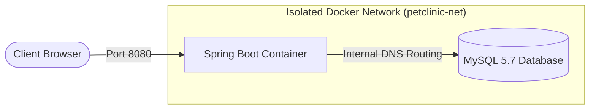

# 🐾 Cloud-Native Spring PetClinic Application

An enterprise-grade, production-hardened deployment of the classic **Spring PetClinic** microservice application using Docker Compose multi-container orchestrations. This architecture is engineered with resource-optimization constraints, non-root security principles, and dynamic service resiliency to guarantee high availability on resource-constrained host environments (e.g., AWS EC2 Free Tier).

---

## 🏗️ Architecture & Component Overview

The containerized environment utilizes an isolated networking layer, optimized memory footprints, and service health checks to decouple component initialization and lifecycle management.



| Component | Technology | Optimization Applied | Role |
| --- | --- | --- | --- |
| **Application Tier** | Spring Boot 4.0.3 + Java 17 | JVM Max Heap Limited (`-Xmx300m`), Resource QuQuota Bound | Serves the web interface and process transaction logic. |
| **Database Tier** | MySQL 5.7 | Disabled Performance Schema, Optimized InnoDB Buffer Pool Size | Persistent storage for application relational schema metadata. |
| **Network Tier** | Docker Bridge Network | Name-based Resolution Isolation (`db-server`) | Secures internal communication between the containers. |

---

## 🛠️ Production-Hardened Features

* **JVM Memory Control:** Hard-capped the Java HotSpot Virtual Machine Heap using explicit `-Xmx300m` configurations to completely mitigate Linux Kernel OOM (Out-of-Memory) Killer triggers.
* **Database Tuning:** Fine-tuned MySQL engine resource parameters (`--innodb_buffer_pool_size=64M` and `--performance-schema=0`) reducing default memory consumption by over 60%.
* **Resiliency & Startup Decoupling:** Implemented health check probing for the database subsystem combined with an `on-failure` recovery restart policy for the application container to safely handle deferred database socket bindings during cold starts.
* **Multi-Stage Build Security:** Enforces a clean separation between the compilation lifecycle and package execution, ensuring no development dependencies leak into the lightweight runtime layer.
* **Non-Root Execution:** The Application tier explicitly runs under a dedicated `springuser` security context to limit host system exposure in case of an application-level exploit.

---

## 📄 Dockerfile (Multi-Stage & Non-Root)

The codebase leverages a standard, highly secure **Multi-Stage Build** to compile and run the Java artifacts efficiently:

```dockerfile
# ==========================================
# Stage 1: Build & Compilation Environment
# ==========================================
FROM maven:3.8.6-openjdk-17 AS builder
WORKDIR /app

# Cache Maven dependencies by copying only the pom.xml first
COPY pom.xml .
RUN mvn dependency:go-offline -B

# Copy application source code and compile the final fat-jar
COPY src ./src
RUN mvn package -DskipTests

# ==========================================
# Stage 2: Minimal Secure Runtime Environment
# ==========================================
FROM openjdk:17-jdk-slim
WORKDIR /app

# Create a secure, isolated non-root system user and group
RUN groupadd -r springgroup && useradd -r -g springgroup springuser

# Copy the pre-compiled executable binary from the builder stage
COPY --from=builder /app/target/*.jar app.jar

# Adjust directory ownership and switch execution context to non-root
RUN chown -R springuser:springgroup /app
USER springuser

EXPOSE 8080

# Dynamic entrypoint script to execute Java processes safely
ENTRYPOINT ["sh", "-c", "java $JAVA_OPTS -jar app.jar"]

```

---

## 📋 Docker Compose Configuration

The operational infrastructure blueprint is fully declared below within the `docker-compose.yml` specification:

```yaml
services:
  spring-app:
    build:
      context: .
      dockerfile: Dockerfile
    ports:
      - "8080:8080"
    restart: on-failure
    environment:
      - SPRING_PROFILES_ACTIVE=mysql
      - SPRING_DATASOURCE_URL=jdbc:mysql://db-server:3306/petclinic?allowPublicKeyRetrieval=true&useSSL=false
      - SPRING_DATASOURCE_USERNAME=petclinic
      - SPRING_DATASOURCE_PASSWORD=petclinic
      - JAVA_OPTS=-Xmx300m -Xms256m
    deploy:
      resources:
        limits:
          memory: 450M
    networks:
      - petclinic-net
    depends_on:
      db-server:
        condition: service_healthy

  db-server:
    image: mysql:5.7
    command: --max_connections=30 --innodb_buffer_pool_size=64M --performance-schema=0
    environment:
      - MYSQL_DATABASE=petclinic
      - MYSQL_USER=petclinic
      - MYSQL_PASSWORD=petclinic
      - MYSQL_ROOT_PASSWORD=root_secure_password
    volumes:
      - mysql-data:/var/lib/mysql
    deploy:
      resources:
        limits:
          memory: 300M
    networks:
      - petclinic-net
    healthcheck:
      test: ["CMD", "mysqladmin", "ping", "-h", "localhost", "-u", "petclinic", "-ppetclinic"]
      interval: 10s
      timeout: 5s
      retries: 5
      start_period: 20s

networks:
  petclinic-net:
    driver: bridge

volumes:
  mysql-data:
    driver: local

```

---

## 🚀 Step-by-Step Deployment Guide

### Prerequisites

* Docker Engine v20.10+ installed.
* Docker Compose V2 v2.0.0+ installed.
* Host system port `8080` unallocated.

### 1. Clone the Application Repositories

First, clone the upstream official Spring Petclinic source repository on your Linux server:

```bash
git clone https://github.com/spring-projects/spring-petclinic.git
cd spring-petclinic

```

### 2. Create Infrastructure Declarations

Create the verified custom `Dockerfile` and `docker-compose.yml` configs within the root clone directory using a standard editor (e.g., `vim` or `nano`):

```bash
vim Dockerfile
vim docker-compose.yml

```

*(Copy and paste the code configurations block specified above into these corresponding files respectively)*.

### 3. Clear Subsystem Inbound Rules & Docker Caches

To eliminate stale routing tables, unmanaged orphan volumes, or bridge interfaces from previous executions:

```bash
docker compose down -v --remove-orphans
docker network prune -f

```

### 4. Build Images & Fire Up the Stack

Initialize the multi-stage artifact compilation process and spin up the backend environment in detached background mode:

```bash
docker compose up -d --build

```

### 5. Monitor Application Initialization Pipeline

Track runtime initialization logs to verify successful scheme migrations and target database handshakes:

```bash
docker compose logs -f spring-app

```

*Wait until the pipeline logs output the following confirmation:*

```text
INFO 1 --- [main] o.s.s.petclinic.PetClinicApplication : Started PetClinicApplication in X seconds

```

---

## 🌐 Verifying Application Access

To interface with the running cluster deployment outside your host network boundary:

1. Retrieve your target host platform external IP (e.g., **AWS EC2 Public IPv4**).
2. Point your remote endpoint client to: `http://<YOUR_AWS_PUBLIC_IP>:8080/`.
<p align="center">
  
  <br>
  <em><b>Figure 1:</b> WebSite Verify </em>
</p>

4. **AWS Security Group Requirement:** Verify that the bound infrastructure Security Group includes an **Inbound Rule** authorizing TCP ingress traffic target over destination port `8080`.

---

## 🔧 Infrastructure Troubleshooting Checkpoints

### 1. `java.net.NoRouteToHostException: Host is unreachable`

If you notice bridge packet switching errors or network interface access failure within application standard output, adjust the host Linux `ufw` packet forwarding parameters:

```bash
sudo ufw allow from 172.17.0.0/16
sudo ufw allow from 172.18.0.0/16
sudo ufw reload
sudo systemctl restart docker

```

### 2. Container Termination Code `137`

Indicates host execution runtime memory throttling (OOM Killer execution trigger). If triggered, verify your memory configuration layout maps neatly within real machine host boundaries (`free -m`).

---

## 🧹 Maintenance and Teardown

To shut down the live container services while maintaining full data persistence state inside decoupled volumes:

```bash
docker compose down

```

To completely reset environment storage tiers (wipes persistent database state):

```bash
docker compose down -v

```

---

💡 **DevOps Operational Note:** This stack configuration enforces an immutable infrastructure pipeline principle. Any codebase modifications require a rebuild flag using `docker compose up -d --build`.

---
**Developed by:** [Eslam Harpy](https://github.com/EslamHarpy)
*Infrastructure & DevOps Engineer*
