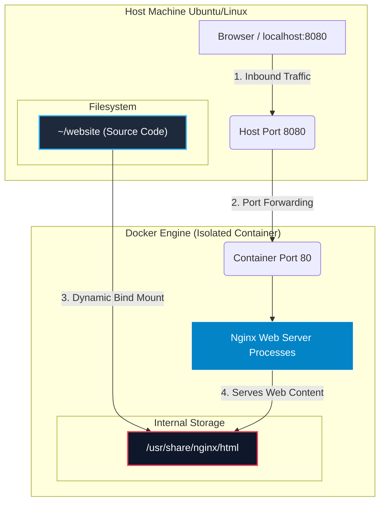
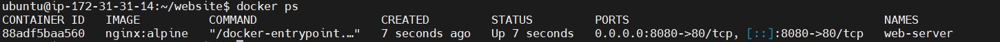
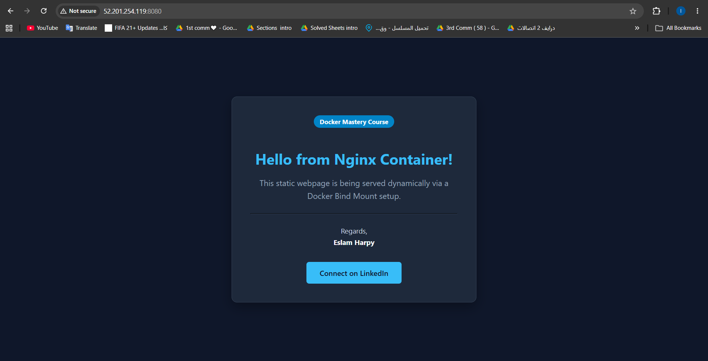

# 🐳 Docker Static Web Server with Bind Mounts
[](https://www.docker.com/)
[](https://nginx.org/)
[](https://www.linux.org/)

A highly optimized and production-ready implementation of a static web server utilizing **Docker Bind Mounts**. This project demonstrates how to decouple source code from the container infrastructure, enabling real-time live reloading without triggering container rebuilds.

---

## 🏗️ System Architecture

The following diagram illustrates the lifecycle of the request, the port mapping (`8080 -> 80`), and how the **Bind Mount** bridges the Host OS storage with the isolated container filesystem.



---

## ⚡ Key Features

* **Instant Hot Reloading:** Changes made to the `index.html` on the host machine reflect instantly in the browser without container restarts.
* **Attack Surface Reduction:** Utilizes the lightweight `nginx:alpine` image distribution instead of standard bulky Debian images.
* **Two-Way Sync (Read-Write):** The volume is mounted with default Read-Write permissions, allowing updates from both the host environment and within the container context if necessary.

---
## 📄 Source Code Overview (`index.html`)

Here is the modern, responsive portfolio page designed with embedded CSS custom properties (Dark Mode) that is served by the container:

```html
<!DOCTYPE html>
<html lang="en">
<head>
    <meta charset="UTF-8">
    <meta name="viewport" content="width=device-width, initial-scale=1.0">
    <title>Eslam Harpy | DevOps Portfolio</title>
    <style>
        :root {
            --bg-color: #0f172a;
            --card-bg: #1e293b;
            --text-color: #f8fafc;
            --accent-color: #38bdf8;
            --accent-hover: #0ea5e9;
        }
        body {
            font-family: 'Segoe UI', Tahoma, Geneva, Verdana, sans-serif;
            background-color: var(--bg-color);
            color: var(--text-color);
            margin: 0;
            display: flex;
            justify-content: center;
            align-items: center;
            height: 100vh;
        }
        .container {
            background-color: var(--card-bg);
            padding: 2.5rem;
            border-radius: 12px;
            box-shadow: 0 10px 25px rgba(0,0,0,0.3);
            text-align: center;
            max-width: 450px;
            width: 90%;
            border: 1px solid #334155;
        }
        h1 {
            color: var(--accent-color);
            margin-bottom: 0.5rem;
            font-size: 2rem;
        }
        p {
            color: #94a3b8;
            font-size: 1.1rem;
            line-height: 1.6;
        }
        .badge {
            background-color: #0284c7;
            color: white;
            padding: 0.3rem 0.8rem;
            border-radius: 20px;
            font-size: 0.85rem;
            font-weight: bold;
            display: inline-block;
            margin-bottom: 1.5rem;
        }
        .btn {
            display: inline-block;
            background-color: var(--accent-color);
            color: #0f172a;
            text-decoration: none;
            padding: 0.8rem 1.8rem;
            border-radius: 6px;
            font-weight: 600;
            transition: background 0.3s ease;
            margin-top: 1rem;
        }
        .btn:hover {
            background-color: var(--accent-hover);
        }
    </style>
</head>
<body>
    <div class="container">
        <div class="badge">Docker Mastery Course</div>
        <h1>Hello from Nginx Container!</h1>
        <p>This static webpage is being served dynamically via a Docker Bind Mount setup.</p>
        <hr style="border-color: #334155; margin: 1.5rem 0;">
        <p style="font-size: 0.95rem; color: #cbd5e1;">Regards,<br><strong style="color: white;">Eslam Harpy</strong></p>
        <a href="https://www.linkedin.com/in/eslamharpy05/" target="_blank" class="btn">Connect on LinkedIn</a>
    </div>
</body>
</html>

```

---
## 🛠️ Step-by-Step Deployment

### 1. Initialize Workspace & Source Code

Run the following commands to set up the directory structure and deploy the modern portfolio interface:

```bash
mkdir -p ~/website && cd ~/website
nano index.html

```

### 2. Launch the Container Runtime

Execute the updated Docker command below:

```bash
docker run -d \
  --name web-server \
  -p 8080:80 \
  -v ~/website:/usr/share/nginx/html \
  nginx:alpine

```

---

## 📸 Execution & Verification (Screenshots)

### 🔹 Terminal Deployment

*Run `docker ps` to verify the container status, uptime, and port mappings:*

<p align="center">
  
  <br>
  <em><b>Figure 1:</b> Container Run Verify </em>
</p>

### 🔹 Web Application Interface

*Access the hosted server by navigating to `http://localhost:8080` in your web browser:*

<p align="center">
  
  <br>
  <em><b>Figure 1:</b> WebSite Verify </em>
</p>

---

## ⚙️ Command Flag Engineering Breakdown

| Parameter | Function | Operational Impact |
| --- | --- | --- |
| `-d` | Detached Mode | Runs container as a background daemon, freeing up terminal control. |
| `--name web-server` | Explicit Naming | Eliminates randomly assigned Docker names for reliable orchestration scripting. |
| `-p 8080:80` | Port Mapping | Bridges external host-level traffic into the isolated containerized network overlay. |
| `-v ...` | Bind Mount | Enforces high-performance directory mapping between host paths and target container directories. |

---

**Developed by:** [Eslam Harpy](https://github.com/EslamHarpy)
*Infrastructure & DevOps Engineer*

