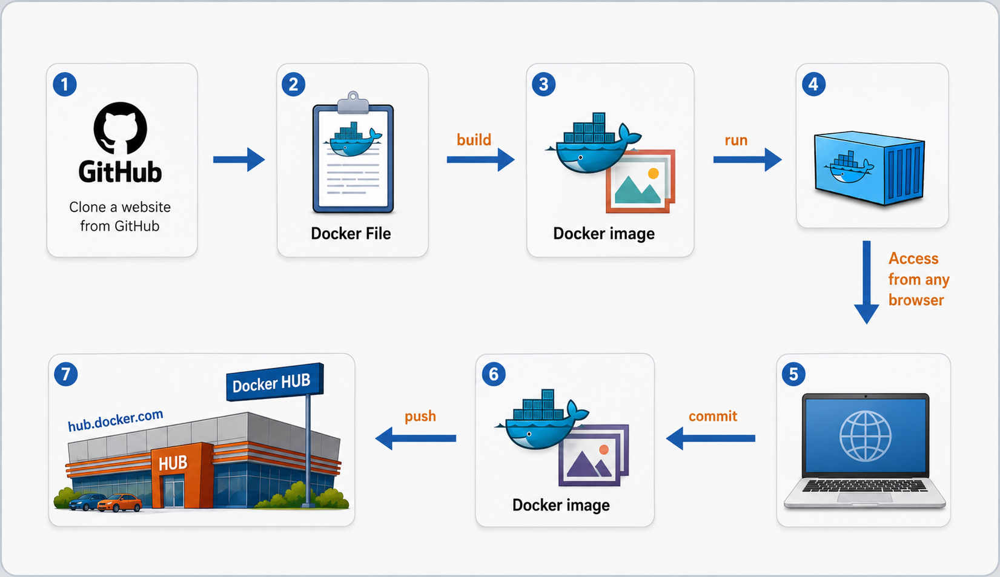
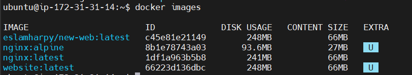
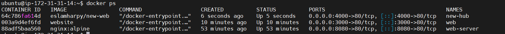
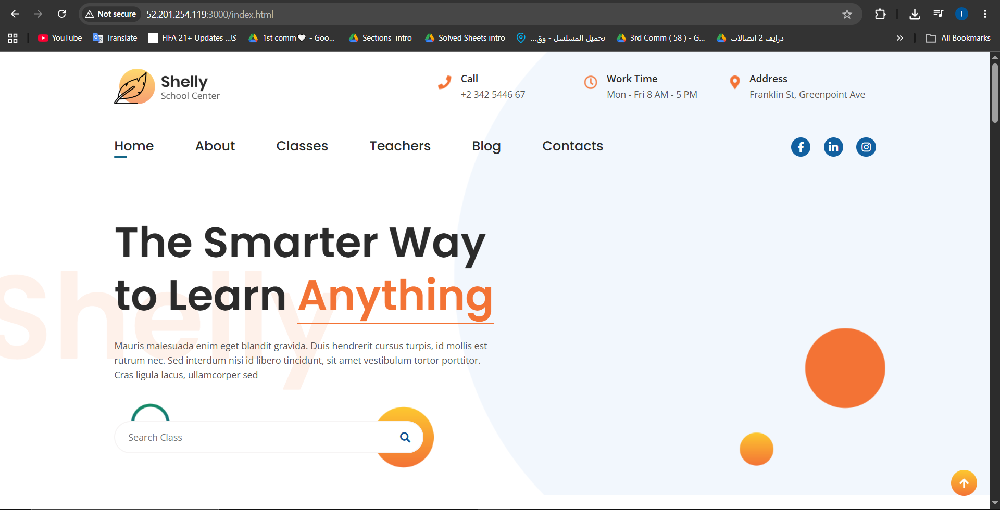
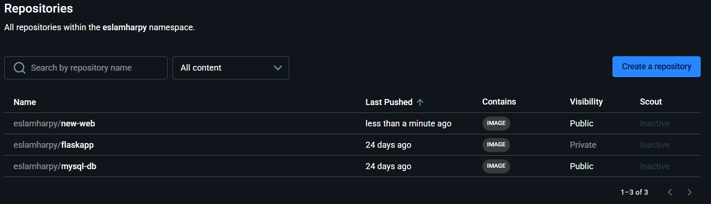
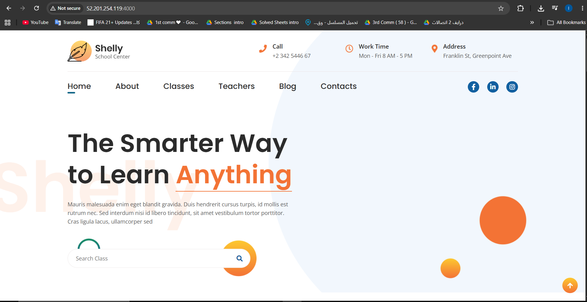

# 🐳 Automated Custom Nginx Web Server Image & Docker Hub Distribution Pipeline

[](https://www.docker.com/)
[](https://nginx.org/)
[](https://git-scm.com/)

A comprehensive, production-grade implementation of an immutable web infrastructure pipeline. This project covers the lifecycle of cloud-native deployment: cloning modern source web assets, building an optimized custom image layer via a `Dockerfile`, debugging runtime ports, capturing live states using container layers (`docker commit`), authenticating against secure registries, and publishing the final verified artifact to **Docker Hub** for global availability.

---

## 🏗️ System Architecture & Workflow

*Below is the architectural diagram showing the source code ingestion, local container compilation, immutable layer committing, and remote distribution lifecycle:*

<p align="center">
  
  <br>
  <em><b>Figure 1:</b> System Architecture Diagram </em>
</p>

---

## 📄 Dockerfile Blueprint

To build the static server container, we leverage the official enterprise high-performance web proxy as our structural baseline:

```dockerfile
# Base layer from high-performance production Nginx distribution
FROM nginx:latest

# Copy customized static web assets into the default Nginx HTML directory
COPY ./Course-Docker/sample-website /usr/share/nginx/html/

# Documenting that the container network interface listens on Port 80 at runtime
EXPOSE 80

```

---

## 🛠️ Step-by-Step Pipeline Execution

### 1. Ingest Source Assets & Code Verification

Clone the source repository onto your host system and analyze the static website file configuration:

```bash
git clone https://github.com/MenaMagdyHalem/Course-Docker.git
cd Course-Docker
ls -la sample-website/

```

### 2. Create and Build the Custom Docker Image

Create your `Dockerfile` at the parent directory, save the blueprint above, and compile the custom image:

```bash
# Create and write Dockerfile
nano Dockerfile

# Build the immutable image tagged as 'website'
docker build -t website .

# Verify the image is stored in the local registry layer cache
docker images

```

### 3. Deploy and Validate Local Container

Run the newly created image to test website stability on Host Port `3000`:

```bash
docker run -it --rm -d -p 3000:80 --name web website

```

* Now open your browser and access: `http://localhost:3000`

### 4. Create an Immutable Snapshot (`docker commit`)

Capture the running runtime container state and save it as a new version layer:

```bash
docker commit web eslamharpy/new-web

```

### 5. Registry Authentication & Image Distribution

Log into your secure Docker Hub registry space and push the custom compiled image:

```bash
# Secure terminal login to Docker Hub
docker login

# Upload the verified image layer out to the cloud registry repository
docker push eslamharpy/new-web

```

### 6. Production Verification (Pull & Run)

Test the remote image delivery by pulling it natively back down from the registry onto any fresh server:

```bash
docker run -it --rm -d -p 4000:80 --name new-hub eslamharpy/new-web

```

* Validate functionality by visiting the production entry point: `http://localhost:4000`

---

## 📸 Execution & Verification (Screenshots)

### 🔹 CLI Environment & Registry Verification (`docker images` & `docker ps`)

*Terminal verification proving successful image generation and active container processes:*

> **Tip:** Capture your terminal output after running `docker images` to show your custom `website` image size and layers.
<p align="center">
  
  <br>
  <em><b>Figure 2:</b> Docker Images Verify </em>
</p>

> **Tip:** Capture your terminal output after running `docker ps` to verify that the web containers are actively mapped to host ports.
<p align="center">
  
  <br>
  <em><b>Figure 3:</b> Containers Run Verify </em>
</p>

### 🔹 Local Web Interface Validation (Port 3000)

*Verifying the running Nginx container serving custom code before registry push:*
<p align="center">
  
  <br>
  <em><b>Figure 4:</b> Website Verify Port 3000 </em>
</p>

### 🔹 Docker Hub Cloud Registry Verification

*Showing the pushed image layer securely residing inside your public registry dashboard (`eslamharpy/new-web`):*
<p align="center">
  
  <br>
  <em><b>Figure 5:</b> Image Push To Docker HUB </em>
</p>

### 🔹 Production Remote Pull Runtime (Port 4000)

*Live execution proof of pulling the image down fresh and running it:*
<p align="center">
  
  <br>
  <em><b>Figure 6:</b> Website Verify Port 4000 </em>
</p>
---

## ⚙️ Engineering Command Reference

| Operational Command | Lifecycle Phase | Functional Scope |
| --- | --- | --- |
| `docker build -t website .` | Image Compilation | Reads current directory context to inject static layers into the image build. |
| `docker run --rm` | Lifecycle Cleanup | Automatically destroys the container instance filesystem upon runtime termination to save resources. |
| `docker commit <id>` | State Snapshotted | Freezes current live storage layers into an immutable container image structure. |
| `docker push ...` | Artifact Distribution | Ships final compiled package payloads into distant cloud container image registries. |

---
**Developed by:** [Eslam Harpy](https://github.com/EslamHarpy)
*Infrastructure & DevOps Engineer*
