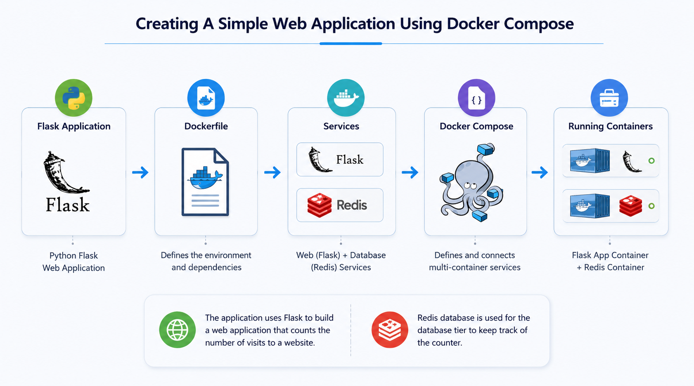
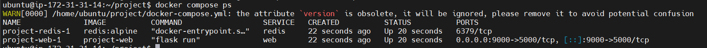
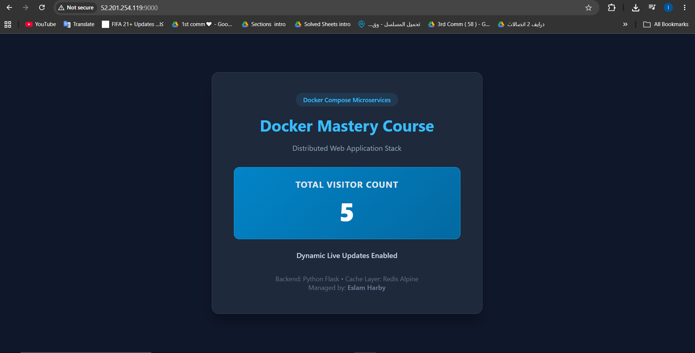

# 🐳 Creating A Simple Web Application Using Docker Compose

[](https://docs.docker.com/compose/)
[](https://flask.palletsprojects.com/)
[](https://redis.io/)

A multi-container microservice infrastructure leveraging **Docker Compose**. This architecture orchestrates a Python Flask frontend application coupled with an isolated Redis in-memory cache layer. It features advanced configuration for developer productivity, including **Bind Mounts** and hot-reloading diagnostics to enable instantaneous live code propagation without rebuilding image layers.

---

## 🏗️ Stack Architecture & Network Layout

*Below is the structural blueprint of the multi-container environment, showcasing port-forwarding, service discovery, and real-time host-to-container synchronization:*

<p align="center">
  
  <br>
  <em><b>Figure 1:</b> Stack Architecture Diagram </em>
</p>

---

## 📁 Project Directory Structure

Before deploying the stack, ensure your local workspace repository layout is structured as follows:

```text
flask-redis-app/
├── app.py                 # Core Python Flask Application & UI Logic
├── Dockerfile             # Multi-layer Docker Build Instructions for Frontend
├── docker-compose.yml     # Multi-Container Orchestration Manifest
├── requirements.txt       # Python Dependency Specifications (Flask, Redis)
└── Screenshots/                # Documentation Assets (Architecture & Screenshots)

```

---

## 🛠️ Infrastructure Configuration Blueprint

### 📄 Multi-Container Manifest (`docker-compose.yml`)

```yaml
version: '3'
services:
  web:
    build: .
    ports:
      - "9000:5000"
    volumes:
      - .:/app
    environment:
      FLASK_DEBUG: "true"
  redis:
    image: "redis:alpine"

```

### 📄 Container Layer Configuration (`Dockerfile`)

```dockerfile
FROM python:3.7-alpine
WORKDIR /app
ENV FLASK_APP=app.py
ENV FLASK_RUN_HOST=0.0.0.0
RUN apk add --no-cache gcc musl-dev linux-headers
COPY requirements.txt requirements.txt
RUN pip install -r requirements.txt
EXPOSE 5000
COPY . .
CMD ["flask", "run"]

```

---

## 🚀 Step-by-Step Deployment Pipeline

### 1. Provision Local Workspace

Create your project root directory and initialize the environment manifests:

```bash
mkdir -p ~/flask-redis-app && cd ~/flask-redis-app
nano app.py          # Paste the Python Flask source code
nano requirements.txt # Add Flask and Redis dependencies
nano Dockerfile       # Paste the multi-layer Dockerfile build instructions
nano docker-compose.yml # Paste the high-performance multi-container manifest

```

### 2. Launch the Multi-Container Cluster

Spin up the decoupled backend services concurrently in detached daemon mode:

```bash
docker compose up -d

```

### 3. Verify Local Runtime State

Inspect active operational layers and live port forwarding:

```bash
docker compose ps

```

* Navigate your browser to: `http://localhost:9000` to interact with the premium real-time tracker dashboard.

---

## 🔄 The Mechanics of Instant Hot-Reloading

### Why did code changes propagate instantly without a rebuild?

When modifying `app.py` directly from the host system, the runtime updates immediately due to two integrated configuration variables in our `docker-compose.yml`:

1. **Host-to-Container Bind Mount (`- .:/app`):** This maps your active host workspace working directory into the container's storage workspace. Files are not cloned statically into the image layer during runtime; they are actively mirrored across filesystems.
2. **Flask Debug Mode Engine (`FLASK_DEBUG: "true"`):** The Werkzeug server module inside the Python process actively watches filesystem inodes (`/app`). The second a file write action happens on the host, the internal server daemon detects the modification and forces an immediate live process refresh.

---

## 📸 Execution & Verification (Screenshots)

### 🔹 Orchestrated Cluster Runtime (`docker compose ps`)

*Proving concurrent operational status for both decoupled web nodes and cache nodes:*

<p align="center">
  
  <br>
  <em><b>Figure 2:</b> Containers Run Verify </em>
</p>

### 🔹 Premium Web UI Dashboard Verification (Port 9000)

*Interactive validation showing the custom designed Flask interface rendering hitting statistics stored inside Redis:*

<p align="center">
  
  <br>
  <em><b>Figure 3:</b> WebSite Verify  </em>
</p>

---

## ⚙️ Engineering Command Reference

| Operational Command | Structural Impact | Functional Scope |
| --- | --- | --- |
| `docker compose up -d` | Infrastructure Orchestration | Automatically parses manifests, provisions network meshes, builds custom layers, and deploys containers. |
| `docker compose down` | Stack Takedown | Gracefully stops execution, tears down networks, and purges short-lived container runtimes. |
| `docker compose up -d --build` | Forced Layer Recompilation | Disregards docker system cache to reconstruct modified baseline image structural blocks. |

---

**Developed by:** [Eslam Harpy](https://github.com/EslamHarpy)
*Infrastructure & DevOps Engineer*
