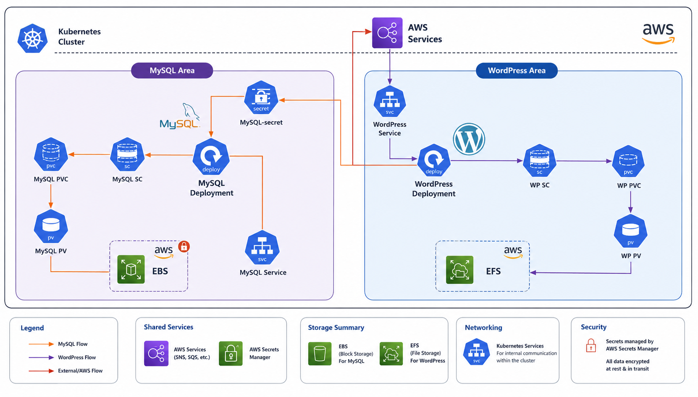
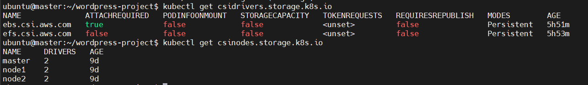
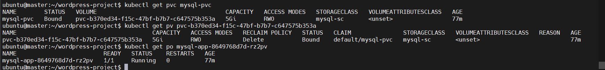
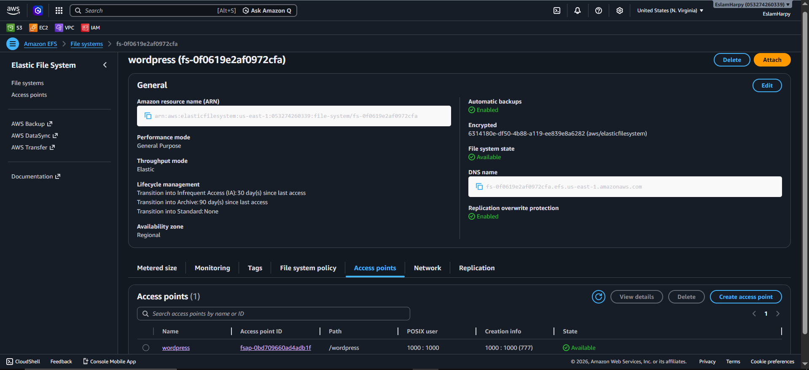
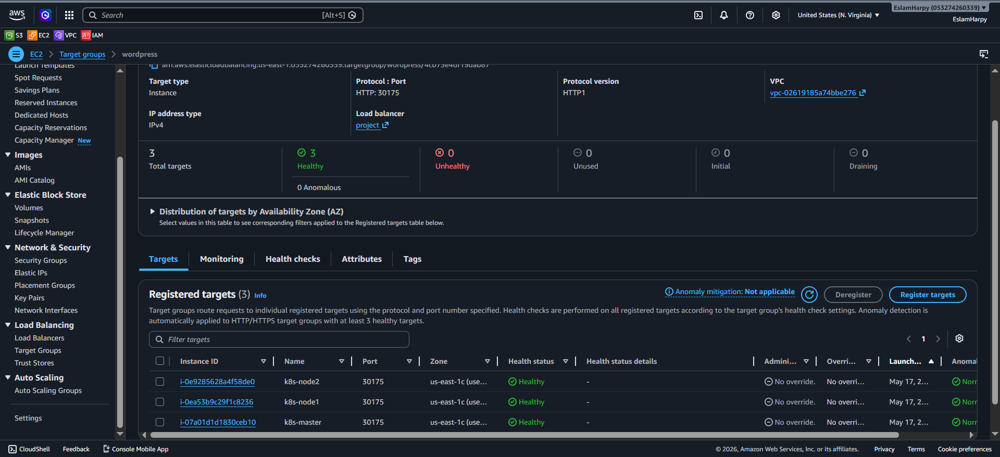
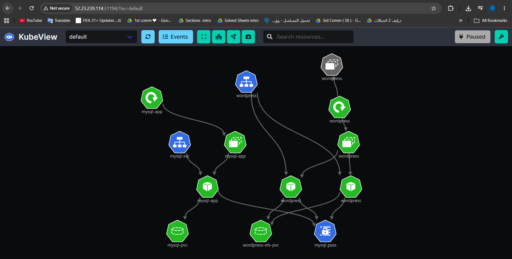
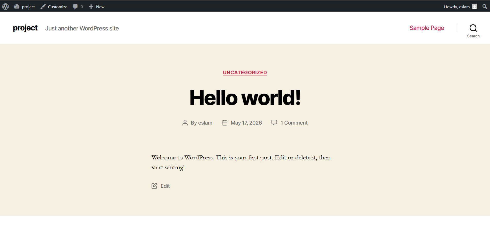

# Enterprise Cloud-Native WordPress Deployment on AWS Self-Managed Kubernetes


An enterprise-grade, highly available WordPress web application architecture deployed on a self-managed, multi-node Kubernetes cluster hosted on Amazon Web Services (AWS) EC2 instances. This project demonstrates real-world implementation of stateful cloud-native applications, automated storage lifecycle management, secrets security control, and cluster state visualization.

---

## 🎯 Architecture & Project Overview

The core objective of this design is to isolate the frontend/presentation layer from the stateful database layer, adhering to modern Cloud Infrastructure best practices:

* **High Availability Frontend Cluster:** WordPress is scaled horizontally across multiple concurrent worker pods. It utilizes **Amazon EFS** via static provisioning ($ReadWriteMany$) to guarantee real-time asset synchronization across separate AWS Availability Zones without data drift.
* **Isolated Persistent Database Core:** Powered by MySQL 5.7, the database runs on single-pod topology backed by dynamic volume provisioning via the **Amazon EBS (gp3)** CSI driver to maximize I/O performance and ensure zero data loss ($ReadWriteOnce$).
* **Automated Edge Access:** Global user routing is automated using an **AWS Elastic Load Balancer (ELB)** mapped to high-range NodePorts across the cluster, completely eliminating port appending in the browser.

<p align="center">
  
  <br>
  <em><b>Figure 0:</b> Project Architecture </em>
</p>

---

## 🛠️ Stack & Tools Directory

| Technology | Domain | Implementation Context |
| :--- | :--- | :--- |
| **AWS EC2** | Compute Infrastructure | Multi-node deployment (1 Master, 2 Worker Nodes) running Ubuntu 22.04 LTS. |
| **AWS EBS (gp3)** | High-Performance Storage | Dynamic volume allocation dedicated to stateful MySQL storage. |
| **AWS EFS** | Network Shared Storage | Distributed filesystem for real-time replica assets synchronization. |
| **Kubernetes** | Container Orchestration | Workload management, manifest declaring, networking, and self-healing. |
| **Helm v3** | Package Control | Automated deployment of official AWS Storage CSI controllers. |
| **KubeView** | Observability Graph | Real-time live visualization of cluster internal API objects. |

---

## 📂 Repository Project Structure

```text
wordpress-project/
├── mysql-sc.yaml          # StorageClass for dynamic AWS EBS (gp3) volumes
├── mysql-pvc.yaml         # PersistentVolumeClaim requesting block storage
├── secret.yaml            # Base64 encrypted credentials for MySQL core authentication
├── mysql-app.yaml         # Deployment definition for MySQL 5.7 database container
├── mysql-svc.yaml         # ClusterIP Service exposing database port 3306 internally
├── wordpress-sc.yaml      # StorageClass routing for AWS EFS drivers
├── wordpress-pv.yaml      # Static PersistentVolume binding to target AWS EFS Access Point
├── wordpress-pvc.yaml     # PersistentVolumeClaim mapping multi-attach storage (RWX)
├── wordpress-app.yaml     # Deployment for scaled WordPress:6-apache nodes (Root bypass)
├── wordpress-svc.yaml     # Ingress/LoadBalancer service routing global web traffic
└── README.md              # Detailed infrastructure documentation & logs

```

---

## ⚙️ Step-by-Step Implementation Journal & Outputs

### Phase 1: Identity & Access Management (IAM) Configuration

To grant the Kubernetes cluster secure authorization to talk to AWS storage services without hardcoding long-lived access tokens:

1. Created an IAM Role with precise trust boundaries targeted at EC2 instances.
2. Attached the standard `AmazonEBSCSIDriverPolicy`.
3. Attached a granular inline policy (`efs-policy`) granting secure handshakes for mounting and tagging operations over AWS EFS networks.

---

### Phase 2: Core Storage Drivers Installation via Helm

Connected to the Master Node control-plane and applied **Helm v3** to install the cloud controllers into the system:

```bash
# Fetch and install Helm package controller
curl -fsSL -o get_helm.sh [https://raw.githubusercontent.com/helm/helm/main/scripts/get-helm-3](https://raw.githubusercontent.com/helm/helm/main/scripts/get-helm-3) && chmod 700 get_helm.sh && ./get_helm.sh

# Install & Synchronize AWS EBS CSI Driver Repository
helm repo add aws-ebs-csi-driver [https://kubernetes-sigs.github.io/aws-ebs-csi-driver](https://kubernetes-sigs.github.io/aws-ebs-csi-driver)
helm repo update
helm upgrade --install aws-ebs-csi-driver aws-ebs-csi-driver/aws-ebs-csi-driver --namespace kube-system

# Install & Synchronize AWS EFS CSI Driver Repository
helm repo add aws-efs-csi-driver [https://kubernetes-sigs.github.io/aws-efs-csi-driver](https://kubernetes-sigs.github.io/aws-efs-csi-driver)
helm repo update
helm upgrade --install aws-efs-csi-driver aws-efs-csi-driver/aws-efs-csi-driver --namespace kube-system

```

📸 **Execution Output Screenshot:**
<p align="center">
  
  <br>
  <em><b>Figure 1:</b> CSI Drivers Verification </em>
</p>

---

### Phase 3: Implementing Database Backend (MySQL)

1. **Secrets Security Control:** Sealed database root access tokens within `secret.yaml` via Base64 encoding.
2. **Storage Optimization:** Modeled `mysql-sc.yaml` configuring `volumeBindingMode: WaitForFirstConsumer` to strictly guarantee that the EBS volume allocation dynamically matches the exact AWS Availability Zone of the worker node executing the workload.
3. **Persistency Bind:** Configured `mysql-pvc.yaml` and deployed `mysql-app.yaml`, binding storage directly to `/var/lib/mysql`.
4. **Internal Micro-Networking:** Exposed the DB internally via a dedicated ClusterIP Service (`mysql-svc.yaml`) mapping port `3306`.

📸 **Execution Output Screenshot:**

<p align="center">
  
  <br>
  <em><b>Figure 2:</b> Backend Implementation Verify (MySQL Database) </em>
</p>

---

### Phase 4: Setting Shared Multi-Attach Network Storage (AWS EFS)

For the frontend WordPress pods to scale horizontally across different availability zones without locking files:

1. Created an **Amazon EFS File System** on the AWS Console.
2. Provisioned an **EFS Access Point** with decoupled POSIX parameters pointing to `/wordpress` to prevent file access issues on instantiation.
3. Network Access Management: Adjusted the File System Security Group to permit incoming traffic over port `2049` (NFS) originating from the Worker Nodes CIDR.
4. Bound the access token to `wordpress-pv.yaml` (`volumeHandle: fs-XXXXXX::fsap-XXXXXX`) and triggered the execution via `wordpress-pvc.yaml` as a **ReadWriteMany** allocation.

📸 **Execution Output Screenshot:**

<p align="center">
  
  <br>
  <em><b>Figure 3:</b> EFS Configurations </em>
</p>

---

### Phase 5: Scaled Application Deployment & Global Load Balancing

1. **Infrastructure Permissions Alignment:** Deployed `wordpress-app.yaml` using the official standard user configurations. The storage access and permissions were successfully resolved at the infrastructure level by strictly auditing the AWS EFS Access Point POSIX policies, rather than forcing container runtime root privileges.
2. **Decoupled Load Balancer Routing:** Configured the frontend applications to gracefully handle public web traffic through standard mapping, ensuring the AWS Elastic Load Balancer (ELB) seamlessly routes external traffic down to the backend high-range NodePorts without URL appending issues.
3. **Horizontal Pod Autoscaling & Resilience:** Scaled the frontend architecture horizontally across multiple cluster nodes to achieve maximum application availability and eliminate single points of failure (SPOF):

```bash
kubectl scale deploy wordpress --replicas=2

```

4. Applied `wordpress-svc.yaml` as `type: LoadBalancer`, automatically spinning up an internet-facing **AWS Application Load Balancer (ALB)**.

📸 **Execution Output Screenshot:**
<p align="center">
  
  <br>
  <em><b>Figure 4:</b> Target Group Healthcheck Verify </em>
</p>

---

## 👁️ Cluster Observability & Topology Mapping (KubeView)

To continuously track the status of API objects, volume bindings, and routing endpoints, **KubeView** was deployed via Helm onto the system:

```bash
helm repo add kubeview [https://benc-uk.github.io/kubeview](https://benc-uk.github.io/kubeview)
helm repo update
helm install kubeview kubeview/kubeview --set service.type=NodePort --set ingress.enabled=false

```

📸 **Execution Output Screenshot:**

<p align="center">
  
  <br>
  <em><b>Figure 5:</b>  KubeView Topology </em>
</p>
---

## 🏁 Final Live Application Verification

Once all components reached a synchronized steady state, the production architecture was verified by routing traffic directly through the public DNS address assigned by the AWS Load Balancer.

📸 **Execution Output Screenshot:**

<p align="center">
  
  <br>
  <em><b>Figure 6:</b> Wordpress APP Dashboard </em>
</p>

---

## 🏁 Conclusion

This project successfully demonstrates the deployment of a highly available, scalable, and secure cloud-native application on a self-managed AWS EC2 Kubernetes cluster. By decoupling the architecture into a stateless frontend layer and a robust stateful database layer, the infrastructure ensures both flexibility and resilience.

Key engineering milestones achieved in this project include:
* **Storage Sovereignty:** Implementing real-world storage orchestration using AWS EBS (gp3) for dedicated high-speed database volumes and AWS EFS for synchronized multi-attach shared filesystems.
* **Production-Grade Problem Solving:** Resolving complex storage permissions and routing mechanics at the infrastructure level by correctly tuning AWS EFS POSIX access points and Target Group configurations.
* **Workload Observability:** Utilizing advanced cluster visualization tools (KubeView) to continuously monitor resource mapping, dependencies, and network architecture health.

This deployment serves as a robust blueprint for running stateful production workloads on custom-managed Kubernetes environments within the AWS Cloud ecosystem. 

---

**Developed by:** [Eslam Harpy](https://github.com/EslamHarpy)
*Infrastructure & DevOps Engineer*
