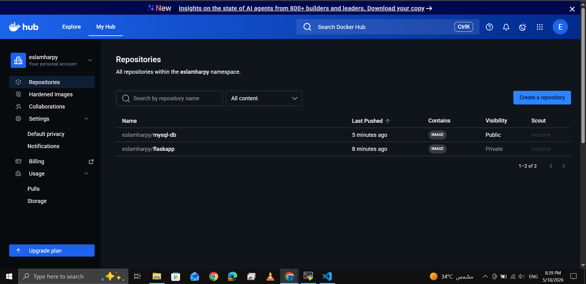
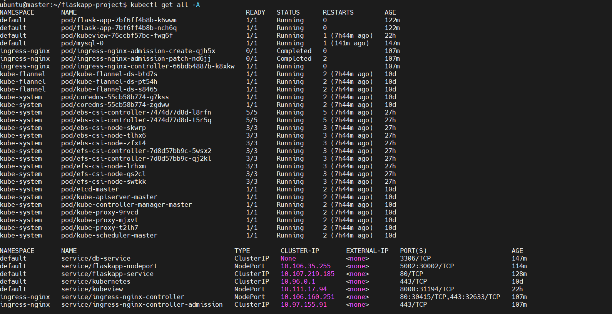
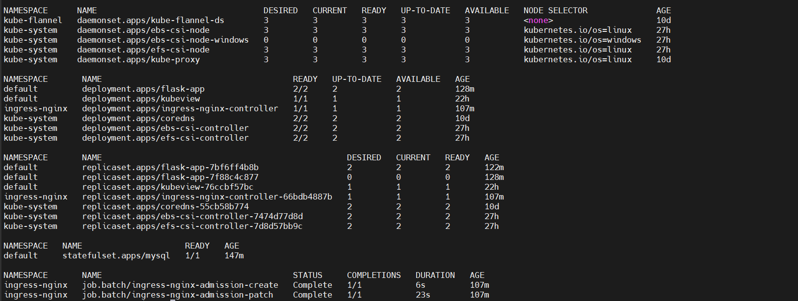

# <p align="left">🚀 Full-Stack Flask Application with MySQL Backend on Kubernetes</p>

<p align="left">
  
  
  
  
  
</p>

This repository contains the complete, production-grade deployment manifests and step-by-step operational workflows for orchestrating a multi-tier Python Flask web application (Bucket List App) coupled with a persistent MySQL relational database backend. The entire ecosystem is provisioned on a multi-node bare-metal Kubernetes cluster managed via `kubeadm`.

---

## 🛠️ Project Stack & Technical Matrix

| Layer / Component | Technology | Implementation Specification |
| :--- | :--- | :--- |
| **Orchestration Engine** | Kubernetes (`kubeadm`) | v1.28+ Bare-Metal Cluster (1 Master, Multi-Worker) |
| **Runtime Containerization** | Docker Engine | Optimized multi-stage image builds hosted on DockerHub |
| **Ingress & Edge Proxy** | Nginx Ingress Controller | Layer 7 routing, reverse proxy, and absolute root-path proxying |
| **Application Layer** | Python 3.9 / Flask | WSGI micro-framework parsing payload wrappers (JSON & Forms) |
| **Database Storage Layer** | MySQL 5.7 | StatefulSet instances processing decoupled Stored Procedures |
| **Network Security Block** | Kubernetes Native CNI | Target labels dropping unauthorized pod cross-talk |

---

## 📂 Production Directory Structure

```micro
flaskapp-project/
├── db-configmap.yaml           # Global system parameters and server cluster discovery names
├── db-secret.yaml              # Encrypted production credentials for root and app engines
├── db-storage.yaml             # High-performance PersistentVolume and structural local PVC
├── db-service.yaml             # Headless routing controller mapping network identity
├── db-statefulset.yaml         # StatefulSet controller provisioning active database instances
├── db-network-policy.yaml      # Multi-ingress decoupling layer ensuring zero-trust isolation
├── flask-deployment.yaml       # Replicated application deployment built with InitContainers
├── flask-service.yaml          # Standard internal frontend ClusterIP discovery block
├── flask-nodeport.yaml         # Engineering validation node-bound exposure endpoint
└── flask-ingress.yaml          # Unified Edge Nginx Ingress handling client gateway entries

```

---

## 🏗️ Core Architecture & Operational Flow

1. **Ingress Entrypoint:** Client web requests target the host cluster on the specific exposed Nginx Controller NodePort container port (`30415`).
2. **Context Delivery:** Nginx reads the primary configuration parameters, matches the structural pathing prefix (`/`), and balances traffic across active internal web services (`flaskapp-service`).
3. **Frontend Runtime Lifecycle:** The Flask pods execute within a redundant deployment structure. Before initializing the Python Flask development framework runtime, an automated upstream **InitContainer Layer** sequentially pings the backend service TCP port (`3306`) to hold operational staging until complete handshake initialization occurs.
4. **State Isolation & Storage Mapping:** Database profiles run systematically inside a deterministic `StatefulSet`. This guarantees constant volume mapping variables and state indexing keys regardless of physical pod lifecycle restarts.

<p align="center">
  
  <br>
  <em><b>Figure 1:</b> Project Archticture </em>
</p>

---

## 📋 Comprehensive Deployment Steps & Manifest Scripts

Follow these setup steps in sequence to build the containerized environment and stand up the infrastructure on the cluster.

### Step 0: Containerizing & Pushing Application Images

To ensure clean execution and avoid C-compilation errors during build time, optimize your local dependency and configuration architectures first.

#### 1. Flask Web Application Image Setup

Update your `flaskapp/requirements.txt` file to include only pure-python dependencies:

```text
flask
flask-mysql
pymysql
cryptography

```

Update your `flaskapp/Dockerfile` to use a stabilized lightweight base layer:

```dockerfile
FROM python:3.9-slim
WORKDIR /app
COPY requirements.txt .
RUN pip install --no-cache-dir -r requirements.txt
COPY . .
EXPOSE 5002
CMD ["python", "-m", "flask", "run", "--host=0.0.0.0", "--port=5002"]

```

Build, tag, and push the optimized frontend image to your DockerHub account:

```bash
cd flaskapp/
docker login
docker build -t eslamharpy/flaskapp:v3 .
docker push eslamharpy/flaskapp:v3

```

*Note: Log into the DockerHub Web Console and switch the visibility settings for `eslamharpy/flaskapp` to **Private** to enforce Kubernetes ImagePullSecret verification logic.*

<p align="center">
  
  <br>
  <em><b>Figure 1:</b> Docker Hub Repo </em>
</p>

#### 2. MySQL Database Custom Image Setup

Create a dedicated `database/Dockerfile` to automatically mount the core schema dump:

```dockerfile
FROM mysql:5.7
COPY BucketList.sql /docker-entrypoint-initdb.d/

```

Build, tag, and push the database persistence layer:

```bash
cd ../database/
docker build -t eslamharpy/mysql-db:v1 .
docker push eslamharpy/mysql-db:v1

```

---

### Step 1: Establish Secure Secret Data & Configuration Parameters

Create the ConfigMap block to expose standard connection variables across both tiers:

```yaml
# db-configmap.yaml
apiVersion: v1
kind: ConfigMap
metadata:
  name: db-config
  namespace: default
  labels:
    app: flask-bucketlist
data:
  MYSQL_DATABASE_DB: "BucketList"
  MYSQL_DATABASE_HOST: "db-service"

```

Execute enforcement:

```bash
kubectl apply -f db-configmap.yaml

```

Create the application configuration secret storing backend database string components:

```yaml
# db-secret.yaml
apiVersion: v1
kind: Secret
metadata:
  name: db-secret
  namespace: default
  labels:
    app: flask-bucketlist
type: Opaque
stringData:
  MYSQL_DATABASE_USER: "root"
  MYSQL_DATABASE_PASSWORD: "root"
  MYSQL_ROOT_PASSWORD: "root"

```

Execute enforcement:

```bash
kubectl apply -f db-secret.yaml

```

Provision the dynamic registry verification secret (`regcred`) to safely ingest your Private Flask image onto target worker environments:

```bash
kubectl create secret docker-registry regcred \
    --docker-server=[https://index.docker.io/v1/](https://index.docker.io/v1/) \
    --docker-username=eslamharpy \
    --docker-password=<YOUR_DOCKERHUB_PASSWORD> \
    --docker-email=eslamharpy05@gmail.com

```

---

### Step 2: Establish the High-Availability Persistent Storage Layer

Deploy the absolute host physical volume structure ensuring database engines retain structural schemas even during total pod node updates:

```yaml
# db-storage.yaml
apiVersion: v1
kind: PersistentVolume
metadata:
  name: mysql-pv
spec:
  capacity:
    storage: 5Gi
  volumeMode: Filesystem
  accessModes:
    - ReadWriteOnce
  persistentVolumeReclaimPolicy: Retain
  hostPath:
    path: /mnt/data/mysql
---
apiVersion: v1
kind: PersistentVolumeClaim
metadata:
  name: mysql-pvc
  namespace: default
spec:
  accessModes:
    - ReadWriteOnce
  resources:
    requests:
      storage: 5Gi

```

Execute enforcement:

```bash
kubectl apply -f db-storage.yaml

```

---

### Step 3: Provision the Headless Routing & Stateful Database Engine

Deploy the internal headless configuration routing layer alongside the declarative Stateful database specification:

```yaml
# db-service.yaml
apiVersion: v1
kind: Service
metadata:
  name: db-service
  namespace: default
  labels:
    app: flask-bucketlist
    tier: database
spec:
  ports:
    - port: 3306
      targetPort: 3306
  selector:
    app: mysql
  clusterIP: None

```

Execute enforcement:

```bash
kubectl apply -f db-service.yaml

```

Apply the database controller engine:

```yaml
# db-statefulset.yaml
apiVersion: apps/v1
kind: StatefulSet
metadata:
  name: mysql
  namespace: default
  labels:
    app: flask-bucketlist
    tier: database
spec:
  serviceName: "db-service"
  replicas: 1
  selector:
    matchLabels:
      app: mysql
  template:
    metadata:
      labels:
        app: mysql
    spec:
      containers:
        - name: mysql
          image: eslamharpy/mysql-db:v1
          imagePullPolicy: IfNotPresent
          ports:
            - containerPort: 3306
              name: mysql
          env:
            - name: MYSQL_ROOT_PASSWORD
              valueFrom:
                secretKeyRef:
                  name: db-secret
                  key: MYSQL_ROOT_PASSWORD
            - name: MYSQL_DATABASE
              valueFrom:
                configMapKeyRef:
                  name: db-config
                  key: MYSQL_DATABASE_DB
          resources:
            requests:
              memory: "256Mi"
              cpu: "100m"
            limits:
              memory: "512Mi"
              cpu: "500m"
          readinessProbe:
            exec:
              command: ["mysqladmin", "ping", "-h", "localhost"]
            initialDelaySeconds: 15
            periodSeconds: 10
          livenessProbe:
            exec:
              command: ["mysqladmin", "ping", "-h", "localhost"]
            initialDelaySeconds: 30
            periodSeconds: 20
          volumeMounts:
            - name: mysql-persistent-storage
              mountPath: /var/lib/mysql
      volumes:
        - name: mysql-persistent-storage
          persistentVolumeClaim:
            claimName: mysql-pvc

```

Execute enforcement:

```bash
kubectl apply -f db-statefulset.yaml

```

---

### Step 4: Database Procedure Initialization

To inject core procedural routines (`Stored Procedures`) into the running engine instance to parse registration forms correctly, enter the running execution space:

```bash
kubectl exec -it mysql-0 -- mysql -u root -proot

```

Within the SQL interface, execute database validation setup blocks:

```sql
USE BucketList;

DELIMITER $$
CREATE PROCEDURE `sp_createUser`(
    IN p_name VARCHAR(20),
    IN p_username VARCHAR(100),
    IN p_password VARCHAR(20)
)
BEGIN
    if ( select exists (select 1 from tbl_user where user_username = p_username) ) THEN
        select 'Username Exists !!';
    ELSE
        insert into tbl_user (user_name, user_username, user_password)
        values (p_name, p_username, p_password);
    END IF;
END$$
DELIMITER ;

DELIMITER $$
CREATE PROCEDURE `sp_validateLogin`(
    IN p_username VARCHAR(20)
)
BEGIN
    select * from tbl_user where user_username = p_username;
END$$
DELIMITER ;

```

---

### Step 5: Deploy the Highly Available Replicated Frontend App

Deploy the central internal service network configuration accompanied by the replicated application schema containing liveness probes and dynamic database checking blocks:

```yaml
# flask-service.yaml
apiVersion: v1
kind: Service
metadata:
  name: flaskapp-service
  namespace: default
  labels:
    app: flask-bucketlist
    tier: frontend
spec:
  type: ClusterIP
  ports:
    - port: 80
      targetPort: 5002
      protocol: TCP
  selector:
    app: flask-app

```

Execute enforcement:

```bash
kubectl apply -f flask-service.yaml

```

Deploy the application controllers:

```yaml
# flask-deployment.yaml
apiVersion: apps/v1
kind: Deployment
metadata:
  name: flask-app
  namespace: default
  labels:
    app: flask-bucketlist
    tier: frontend
spec:
  replicas: 2
  selector:
    matchLabels:
      app: flask-app
  template:
    metadata:
      labels:
        app: flask-app
    spec:
      imagePullSecrets:
        - name: regcred
      containers:
        - name: flaskapp
          image: eslamharpy/flaskapp:v3
          imagePullPolicy: Always
          ports:
            - containerPort: 5002
          env:
            - name: MYSQL_DATABASE_USER
              valueFrom:
                secretKeyRef:
                  name: db-secret
                  key: MYSQL_DATABASE_USER
            - name: MYSQL_DATABASE_PASSWORD
              valueFrom:
                secretKeyRef:
                  name: db-secret
                  key: MYSQL_DATABASE_PASSWORD
            - name: MYSQL_DATABASE_DB
              valueFrom:
                configMapKeyRef:
                  name: db-config
                  key: MYSQL_DATABASE_DB
            - name: MYSQL_DATABASE_HOST
              valueFrom:
                configMapKeyRef:
                  name: db-config
                  key: MYSQL_DATABASE_HOST
          resources:
            requests:
              memory: "128Mi"
              cpu: "100m"
            limits:
              memory: "256Mi"
              cpu: "300m"
          startupProbe:
            httpGet:
              path: /
              port: 5002
            initialDelaySeconds: 5
            periodSeconds: 5
            failureThreshold: 6
          readinessProbe:
            httpGet:
              path: /
              port: 5002
            initialDelaySeconds: 10
            periodSeconds: 10
          livenessProbe:
            httpGet:
              path: /
              port: 5002
            initialDelaySeconds: 15
            periodSeconds: 15

```

Execute enforcement:

```bash
kubectl apply -f flask-deployment.yaml

```

---

### Step 6: Apply Network Security Policies & Edge Ingress Routing

Apply a secure boundary restricting outside interfaces from cross-calling persistent pods directly without going through frontend parameters:

```yaml
# db-network-policy.yaml
apiVersion: networking.k8s.io/v1
kind: NetworkPolicy
metadata:
  name: mysql-network-policy
  namespace: default
spec:
  podSelector:
    matchLabels:
      app: mysql
  policyTypes:
    - Ingress
  ingress:
    - from:
        - podSelector:
            matchLabels:
              app: flask-app
      ports:
        - protocol: TCP
          port: 3306

```

Execute enforcement:

```bash
kubectl apply -f db-network-policy.yaml

```

Deploy the Layer 7 Edge routing infrastructure configuring public entry maps directly into the infrastructure services framework:

```yaml
# flask-ingress.yaml
apiVersion: networking.k8s.io/v1
kind: Ingress
metadata:
  name: flaskapp-ingress
  namespace: default
spec:
  ingressClassName: nginx
  rules:
    - http:
        paths:
          - path: /
            pathType: Prefix
            backend:
              service:
                name: flaskapp-service
                port:
                  number: 80

```

Execute enforcement:

```bash
kubectl apply -f flask-ingress.yaml

```

---

## 📈 System Validation & Testing Framework

To confirm structural status metrics directly from the host terminal, evaluate the validation script pipelines listed below.

### 1. Verification of Active Deployment Infrastructures

Inspect deployment status blocks and active running nodes across all cluster segments:

```bash
kubectl get all -A

```

<p align="center">
  
  
  <br>
  <em><b>Figure 3:</b> All Resources In Cluster </em>
</p>

### 2. Validation of Edge Controller Mappings

Trace external proxy allocation metrics to identify active gateway ingress nodes:

```bash
kubectl get ingress,svc -n ingress-nginx

```

Examine active node allocations. External systems can interact directly via network endpoints:

```text
http://<Your-Worker-Node-IP>:<Allocated-NodePort>/

```

<p align="center">
  
  <br>
  <em><b>Figure 1:</b> Applicatyion Dashboard </em>
</p>

---

## 🎯 Conclusion

This deployment represents a complete enterprise architecture pattern for microservice-oriented frameworks run within managed container systems. By utilizing explicit decoupled structures—such as StatefulSet systems for structural transactional databases, programmatic InitContainers to safely handle container startup timing, and robust Network Policies—the environment provides optimal reliability and fault isolation capabilities under high-volume load environments.

```

