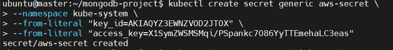
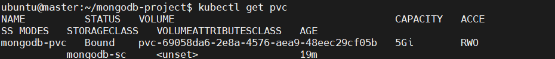
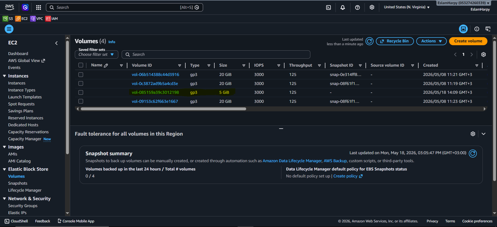
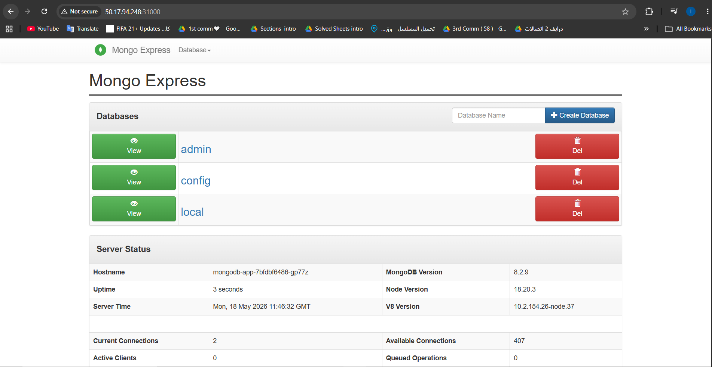

# MongoDB & Mongo-Express on Kubernetes with AWS EBS Persistent Storage
<p align="left">
  
  
  
</p>

This repository contains the complete Kubernetes manifests and step-by-step guide to deploy a highly available and persistent **MongoDB** database coupled with a **Mongo-Express** web management interface. The storage backend is dynamically provisioned via AWS Elastic Block Store (EBS) using the AWS EBS CSI Driver.

---

## 🏗️ Architecture Overview

The project reference architecture implements a secure and isolated infrastructure within Kubernetes:

* **Database Layer (Private):** MongoDB deployment managed via a `ClusterIP` service, ensuring it is only accessible internally within the cluster.
* **Web GUI Layer (Public):** Mongo-Express interface exposed externally using a `LoadBalancer` service to allow secure administrative access.
* **Persistence Storage Layer:** Powered by **AWS EBS CSI Driver** utilizing a custom `StorageClass` with `WaitForFirstConsumer` binding mode for localized, multi-AZ deployment optimization.
* **Configuration & Security:** Decoupled sensitive data (credentials) using Kubernetes `Secrets` and environment configurations via `ConfigMaps`.

<p align="center">
  
  <br>
  <em><b>Figure 1:</b> Project Archticture </em>
</p>

---
## 📂 Project Directory Structure

```text
mongodb-project/
├── mongodb-secret.yaml       # Database sensitive credentials (Base64)
├── mongodb-sc.yaml           # AWS EBS CSI StorageClass (WaitForFirstConsumer)
├── mongodb-pvc.yaml          # Persistent Volume Claim requesting 5Gi
├── mongodb-app.yaml          # MongoDB Deployment
├── mongodb-svc.yaml          # MongoDB ClusterIP Service
├── mongodb-cm.yaml           # ConfigMap holding DB connection string
├── mongo-express-app.yaml    # Mongo-Express Web UI Deployment
└── mongo-express-svc.yaml    # Mongo-Express LoadBalancer/NodePort Service
```
---

## 🛠️ Tools & Technologies Used

| Tool / Technology | Purpose | Documentation |
| :--- | :--- | :--- |
| **Kubernetes (v1.30+)** | Container Orchestration & Lifecycle Management | [Kubernetes Docs](https://kubernetes.io/docs/) |
| **AWS EBS CSI Driver** | Dynamic Provisioning of AWS EBS Volumes | [AWS CSI Driver Docs](https://github.com/kubernetes-sigs/aws-ebs-csi-driver) |
| **MongoDB** | NoSQL Core Database Engine | [MongoDB Docs](https://www.mongodb.com/docs/) |
| **Mongo-Express** | Web-based Administrative Interface for MongoDB | [Mongo-Express GitHub](https://github.com/mongo-express/mongo-express) |
| **AWS IAM** | Secure Access Management via Roles and Policies | [AWS IAM Docs](https://aws.amazon.com/iam/) |

---
## 🚀 Step-by-Step Deployment Guide

### Step 1: AWS Infrastructure Prerequisites & CSI Driver Setup

1. Create an IAM User (e.g., `ebs-user`) or an IAM Role in your AWS Console and attach the official **`AmazonEBSCSIDriverPolicy`** policy.
2. Generate an AWS Access Key and Secret Key for authentication.
3. Deploy the Kubernetes secret containing your AWS credentials inside the `kube-system` namespace to allow the driver to provision volumes on AWS:
   
```bash
kubectl create secret generic aws-secret \
    --namespace kube-system \
    --from-literal "key_id=YOUR_AWS_ACCESS_KEY_ID" \
    --from-literal "access_key=YOUR_AWS_SECRET_ACCESS_KEY"

```

4. Install the **AWS EBS CSI Driver** onto your cluster.

### AWS IAM Configuration Reference:
<p align="center">
  
  <br>
  <em><b>Figure 2:</b> AWS IAM Policy Setup </em>
</p>


### Step 2: Configure Database Secrets

Encode your desired database administrator username and password using `base64` and apply the Kubernetes Secret manifest:

```bash
echo -n 'your-username' | base64
echo -n 'your-password' | base64

```

Create `mongodb-secret.yaml`:

```yaml
apiVersion: v1
kind: Secret
metadata:
  name: mongodb-pass
type: Opaque
data:
  username: <BASE64_ENCODED_USERNAME>
  password: <BASE64_ENCODED_PASSWORD>

```

Apply the manifest:

```bash
kubectl apply -f mongodb-secret.yaml

```

### Step 3: Provision Persistent Storage (StorageClass & PVC)

Create the dynamic StorageClass (`mongodb-sc.yaml`) specifying the AWS EBS driver provisioner, and a PersistentVolumeClaim (`mongodb-pvc.yaml`) requesting `5Gi` of persistent capacity.

*Note: The binding mode is set to `WaitForFirstConsumer` so that AWS provisions the EBS volume in the exact Availability Zone where the MongoDB pod gets scheduled.*

```yaml
# mongodb-sc.yaml
apiVersion: storage.k8s.io/v1
kind: StorageClass
metadata:
  name: mongodb-sc
provisioner: ebs.csi.aws.com
volumeBindingMode: WaitForFirstConsumer
---
# mongodb-pvc.yaml
apiVersion: v1
kind: PersistentVolumeClaim
metadata:
  name: mongodb-pvc
spec:
  accessModes:
    - ReadWriteOnce
  storageClassName: mongodb-sc
  resources:
    requests:
      storage: 5Gi

```

Apply the storage configurations:

```bash
kubectl apply -f mongodb-sc.yaml
kubectl apply -f mongodb-pvc.yaml

```

### Initial Storage State (Waiting for Consumer):

<p align="center">
  
  <br>
  <em><b>Figure 3:</b> Kubernetes PVC Pending Status </em>
</p>

### Step 4: Deploy MongoDB (Database)

Create `mongodb-app.yaml` and `mongodb-svc.yaml` to deploy the database container, mount the external AWS volume to `/data/db`, and expose it internally via port `27017`.

```yaml
# mongodb-app.yaml
apiVersion: apps/v1
kind: Deployment
metadata:
  name: mongodb-app
spec:
  replicas: 1
  selector:
    matchLabels:
      app: mongodb
  template:
    metadata:
      labels:
        app: mongodb
    spec:
      containers:
      - name: mongodb
        image: mongo
        ports:
          - containerPort: 27017
        env:
          - name: MONGO_INITDB_ROOT_USERNAME
            valueFrom:
              secretKeyRef:
                name: mongodb-pass
                key: username
          - name: MONGO_INITDB_ROOT_PASSWORD
            valueFrom:
              secretKeyRef:
                name: mongodb-pass
                key: password
        volumeMounts:
        - name: mongo-storage
          mountPath: /data/db
      volumes:
      - name: mongo-storage
        persistentVolumeClaim:
          claimName: mongodb-pvc
---
# mongodb-svc.yaml
apiVersion: v1
kind: Service
metadata:
  name: mongodb-svc
spec:
  selector:
    app: mongodb
  ports:
    - port: 27017
      targetPort: 27017

```

Apply the database application stack:

```bash
kubectl apply -f mongodb-app.yaml
kubectl apply -f mongodb-svc.yaml

```
### Dynamic EBS Volume Provisioning Verification:

<p align="center">
  
  <br>
  <em><b>Figure 4:</b> Kubernetes PVC Bound Status </em>
</p>
<p align="center">
  
  <br>
  <em><b>Figure 5:</b> AWS Dynamic EBS Volume Created </em>
</p>

### Step 5: Deploy Mongo-Express (Web Interface)

Decouple the application database endpoints using a ConfigMap (`mongodb-cm.yaml`). Then, deploy the UI component (`mongo-express-app.yaml`) and expose it through a LoadBalancer service (`mongo-express-svc.yaml`) bound to a custom NodePort `31000` for accessibility.

```yaml
# mongodb-cm.yaml
apiVersion: v1
kind: ConfigMap
metadata:
  name: mongodb-cm
data:
  database_url: mongodb-svc
---
# mongo-express-app.yaml
apiVersion: apps/v1
kind: Deployment
metadata:
  name: mongo-express-app
spec:
  replicas: 1
  selector:
    matchLabels:
      app: mongo-express
  template:
    metadata:
      labels:
        app: mongo-express
    spec:
      containers:
      - name: mongo-express
        image: mongo-express
        ports:
          - containerPort: 8081
        env:
          - name: ME_CONFIG_MONGODB_ADMINUSERNAME
            valueFrom:
              secretKeyRef:
                name: mongodb-pass
                key: username
          - name: ME_CONFIG_MONGODB_ADMINPASSWORD
            valueFrom:
              secretKeyRef:
                name: mongodb-pass
                key: password
          - name: ME_CONFIG_MONGODB_SERVER
            valueFrom:
              configMapKeyRef:
                name: mongodb-cm
                key: database_url
---
# mongo-express-svc.yaml
apiVersion: v1
kind: Service
metadata:
  name: mongo-express-svc
spec:
  selector:
    app: mongo-express
  type: LoadBalancer 
  ports:
    - protocol: TCP
      port: 8081
      targetPort: 8081
      nodePort: 31000

```

Apply the web interface components:

```bash
kubectl apply -f mongodb-cm.yaml
kubectl apply -f mongo-express-app.yaml
kubectl apply -f mongo-express-svc.yaml

```

---

## 🔍 Verification & Troubleshooting

To ensure the cluster architecture status is operating correctly, execute the verification suite:

```bash
# Check deployment & pod statuses (Should be 1/1 Running)
kubectl get deploy,po

# Verify that the StorageClass triggered dynamic provisioning on AWS
kubectl get pvc,pv

# Get the external connection endpoint / port for access
kubectl get svc

```
### Step 6: Accessing the Mongo-Express Web Dashboard

When you access the Mongo-Express Web interface for the first time via `http://<NODE_IP>:31000`, a browser sign-in pop-up will prompt you for credentials. This is the application's built-in **Basic Authentication** layer.

* **Default Username:** `admin`
* **Default Password:** `pass`

🔒 **Security Note:** These are the default placeholder credentials provided by the official image. To customize the dashboard credentials for production or security compliance, you can inject the following environment variables into your `mongo-express-app.yaml` manifest:
 ```yaml
 - name: ME_CONFIG_BASICAUTH_USERNAME
   value: "your_secure_username"
 - name: ME_CONFIG_BASICAUTH_PASSWORD
   value: "your_secure_password"

```

Once everything displays `Running` and the PVC status changes to `Bound`, you can visit your web dashboard through your master node IP or external load balancer address at port `8081` (or custom NodePort `31000`).

## 🎯 Final Verification

Once authenticated, you will be redirected to the main administrative dashboard showing successful connectivity to the backend MongoDB instance:

<p align="center">
  
  <br>
  <em><b>Figure 6:</b> Mongo Express Dashboard Success </em>
</p>

---
## 🎯 Conclusion

This project successfully demonstrates a modern cloud-native architecture implementation, successfully deploying a stateful application on **Kubernetes** with dynamic external cloud storage. 

By decoupling configurations using **ConfigMaps** and securing sensitive access credentials through **Kubernetes Secrets**, the architecture adheres to industry-standard DevOps practices. The integration of the **AWS EBS CSI Driver** with a dynamic `StorageClass` utilizing the `WaitForFirstConsumer` binding mode highlights an optimized storage design—ensuring that persistent infrastructure is provisioned strictly in correlation with localized cluster nodes to prevent cross-AZ latency or mounting issues.

Ultimately, this workflow bridges the gap between application deployment and enterprise infrastructure orchestration, validating robust concepts of data persistence, decoupled configurations, and cloud infrastructure operations.

---

**Developed by:** [Eslam Harpy](https://github.com/EslamHarpy)
*Infrastructure & DevOps Engineer*
