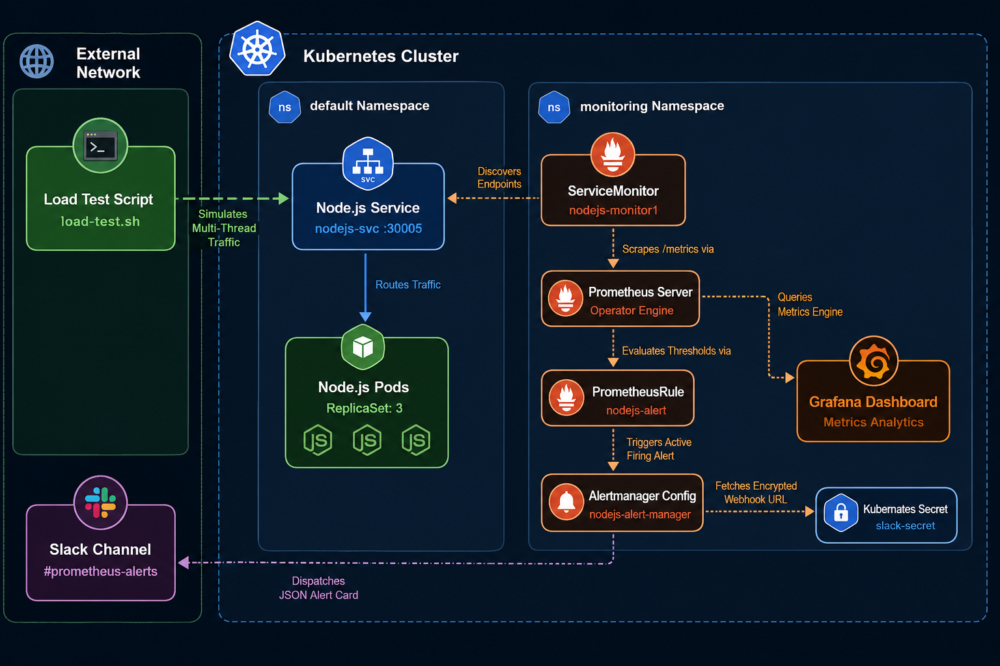
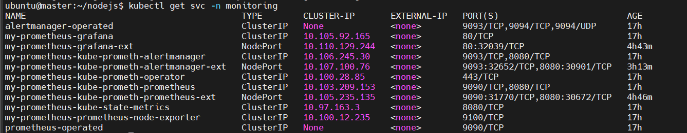
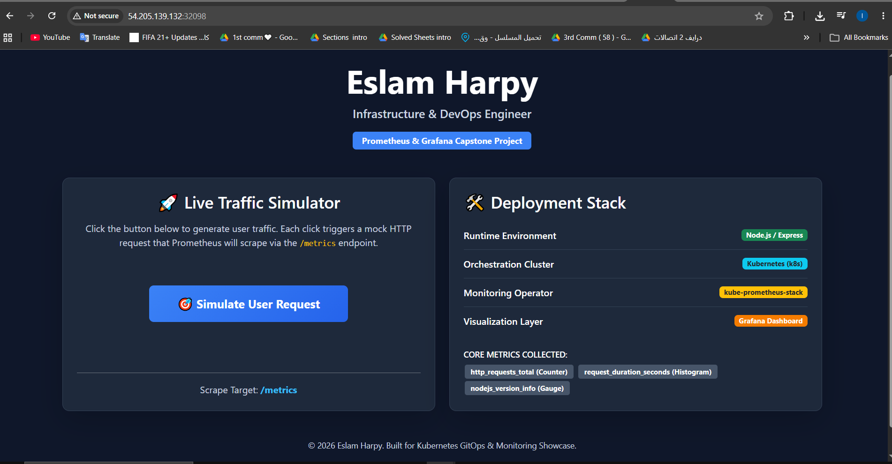
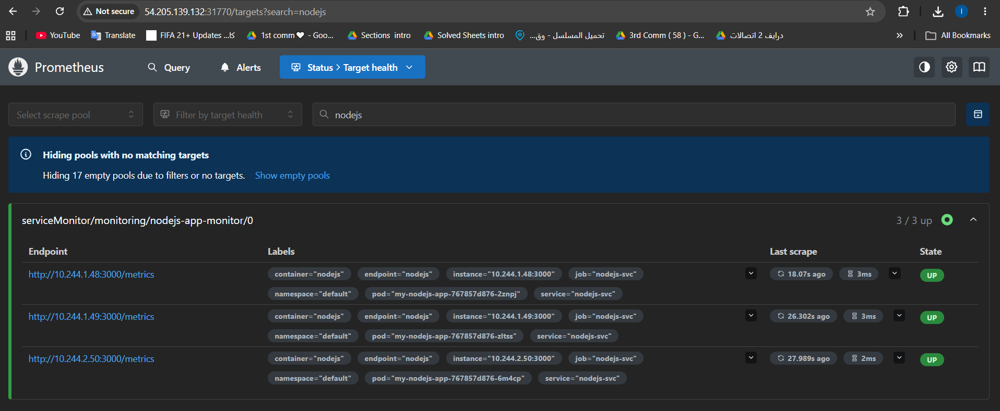
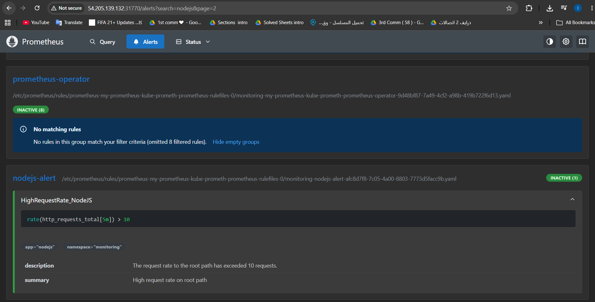
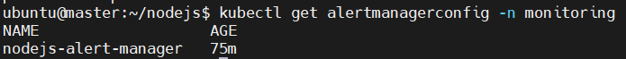
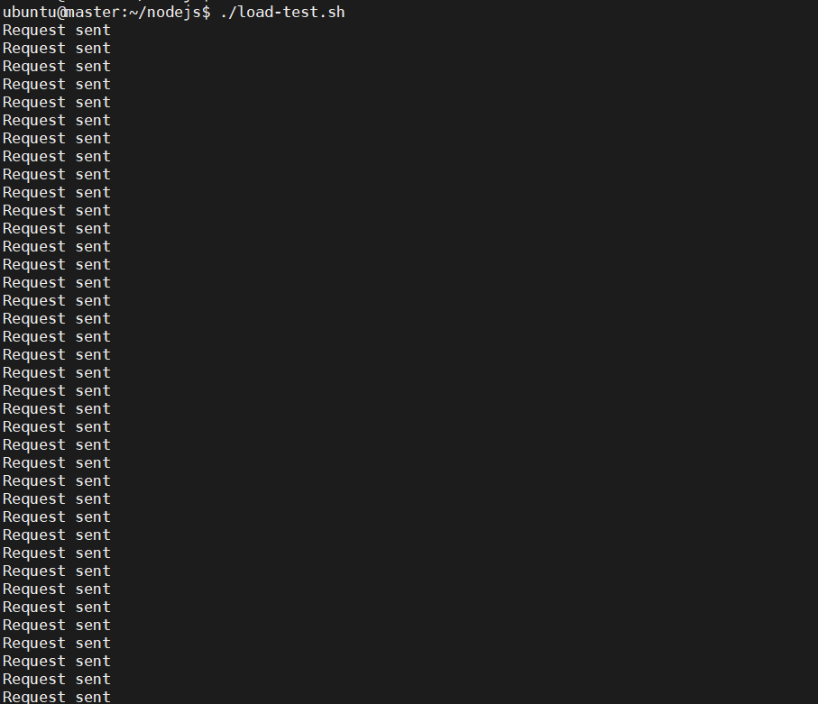
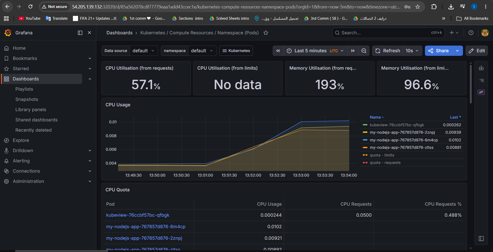
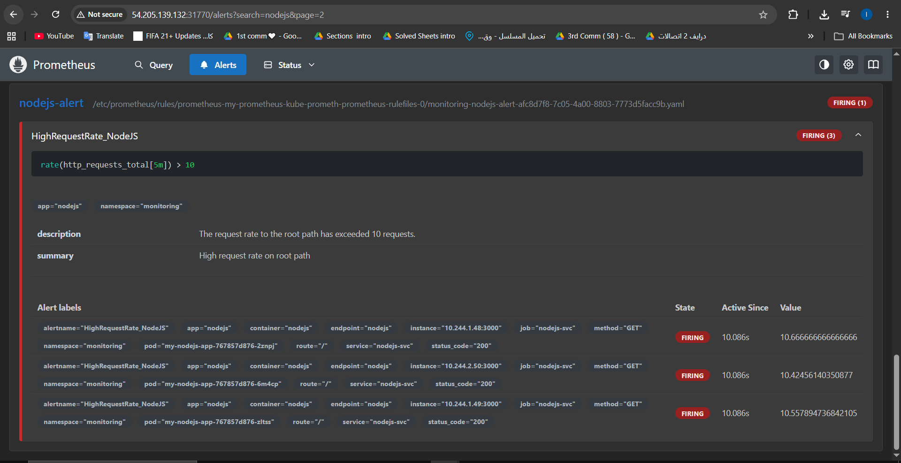
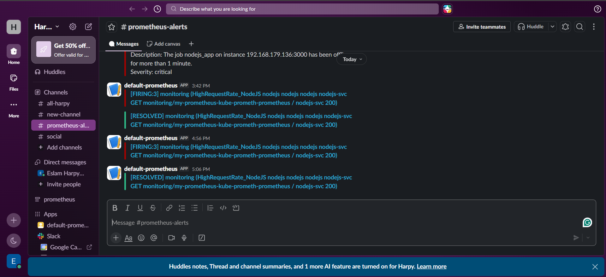

# 🚀 Cloud-Native Node.js Infrastructure Monitoring via Prometheus Operator & Grafana
<p align="left">
  
  
  
  
  
  
  
</p>

## 📌 Project Overview

This project demonstrates an enterprise-grade, cloud-native monitoring and alerting infrastructure deployed on a Kubernetes cluster. The target application is a custom-built, high-contrast **Node.js/Express** backend system engineered by **Eslam Harpy**. The entire observability layer is managed declaratively using the **Prometheus Operator (kube-prometheus-stack)**. This architecture implements dynamic target scraping, precise custom threshold alert routing, and a production-ready **Slack ChatOps integration**.

---

## 🛠️ Table of Tools

| Tool / Technology | Purpose in Infrastructure | Deployment Method | Namespace |
| --- | --- | --- | --- |
| **Kubernetes (k8s)** | Container Orchestration & Cluster Management | Self-Managed Cluster | `Multiple` |
| **Node.js / Express** | Backend Microservice Tier & Traffic UI Environment | Custom Docker Image | `default` |
| **Prometheus Operator** | Automated Scrape Lifecycle Management & Rules Evaluation | Helm (`kube-prometheus-stack`) | `monitoring` |
| **Alertmanager** | Alert Deduplication, Grouping, and Routing Engine | Helm Lifecycle Hook | `monitoring` |
| **Grafana** | Real-time Analytics Dashboard & Metric Visualization | Helm Lifecycle Hook | `monitoring` |
| **Slack Webhook API** | ChatOps Incident Management & Alert Forwarding | External Integration Target | `External` |

---

## 🏗️ Infrastructure Architecture 

<p align="center">
  
  <br>
  <em><b>Figure 1:</b> System Architecture Diagram </em>
</p>


---

## 📁 Project Directory Structure

```text
.
├── app/
│   ├── index.js                  # Instrumented Node.js Application Core with High-Contrast UI
│   ├── package.json              # Application dependencies (express, prom-client)
│   └── Dockerfile                # Multi-stage production build schema
├── k8s/
│   ├── nodejs-app.yaml           # Deployment (3 Replicas) 
│   ├── nodejs-svc.yaml           # NodePort Service Manifest
│   ├── nodejs-monitor.yaml       # Custom ServiceMonitor for Prometheus Operator Discovery
│   ├── nodejs-alert.yaml         # PrometheusRule containing HighRequestRate_NodeJS alert logic
│   ├── slack-secret.yaml         # Kubernetes Secret storing the Slack Inbound Webhook URL via stringData
│   └── nodejs-alert-manager.yaml # AlertmanagerConfig routing policy with matching filters
└── scripts/
    └── load-test.sh              # Concurrent multi-process Bash traffic simulator script

```

---

## 💻 Application Tier & Docker Configuration

### 1. Application Manifest Config (`app/index.js`)

The application is custom-configured to expose metric hooks for Prometheus scraping while rendering a high-contrast dark-themed control interface.

```javascript
const express = require('express');
const client = require('prom-client');

const app = express();
const port = process.env.PORT || 3000;

const register = new client.Registry();
client.collectDefaultMetrics({ register });

// Custom Prometheus counter metrics configuration
const httpRequestsTotal = new client.Counter({
  name: 'http_requests_root_total',
  help: 'Total number of HTTP requests to the root path',
  labelNames: ['method', 'route', 'status_code'],
});
register.registerMetric(httpRequestsTotal);

app.use((req, res, next) => {
  if (req.path === '/') {
    httpRequestsTotal.labels(req.method, req.path, 200).inc();
  }
  next();
});

app.get('/', (req, res) => {
  res.send(`
  <!DOCTYPE html>
  <html>
  <head>
    <title>Eslam Harpy | DevOps Metrics App</title>
    <link href="https://cdn.jsdelivr.net/npm/bootstrap@5.3.0/dist/css/bootstrap.min.css" rel="stylesheet">
    <style>
      body { background-color: #0f172a !important; color: #ffffff !important; }
      .card-custom { background-color: #1e293b !important; border: 1px solid #334155 !important; }
    </style>
  </head>
  <body class="container py-5 text-center">
    <h1 class="display-4 fw-bold">Eslam Harpy</h1>
    <p class="lead text-muted">Infrastructure & DevOps Engineer</p>
    <div class="card card-custom p-5 shadow-lg my-4">
      <h3>🚀 Live Traffic Simulator</h3>
      <button class="btn btn-primary btn-lg my-3" onclick="fetch('/')">Simulate User Request</button>
      <div>Scrape Target: <a href="/metrics" target="_blank" class="text-info">/metrics</a></div>
    </div>
  </body>
  </html>`);
});

app.get('/metrics', async (req, res) => {
  res.set('Content-Type', register.contentType);
  res.end(await register.metrics());
});

app.listen(port, () => console.log(`Running on port ${port}`));

```

### 2. Dependency Resolution Config (`app/package.json`)

```json
{
  "name": "nodejs-app-prom",
  "version": "1.0.0",
  "main": "index.js",
  "dependencies": {
    "express": "^4.19.2",
    "prom-client": "^15.1.2"
  }
}

```

### 3. Containerization Engine Config (`app/Dockerfile`)

Productionized Docker configuration mapping strict execution rules and stripping development environments via lightweight Alpine blueprints.

```dockerfile
FROM node:18-alpine
WORKDIR /usr/src/app
COPY package*.json ./
RUN npm install --only=production
COPY . .
EXPOSE 3000
CMD ["node", "index.js"]

```

---

## 🛠️ Step-by-Step Installation, Configuration & Verification

### Step 1: Bootstrap the Monitoring Stack (Helm)

```bash
# Helm installation
curl https://baltocdn.com/helm/signing.asc | gpg --dearmor | sudo tee /usr/share/keyrings/helm.gpg > /dev/null
sudo apt-get install apt-transport-https --yes
echo "deb [arch=$(dpkg --print-architecture) signed-by=/usr/share/keyrings/helm.gpg] https://baltocdn.com/helm/stable/debian/ all main" | sudo tee /etc/apt/sources.list.d/helm-stable-debian.list
sudo apt-get update
sudo apt-get install helm -y

# Add Prometheus Stack Repo
helm repo add prometheus-community https://prometheus-community.github.io/helm-charts
helm repo update

# Deploy cluster core monitoring controllers
helm install my-prometheus prometheus-community/kube-prometheus-stack -n monitoring --create-namespace

# Expose UI Dashboards externally via NodePorts
kubectl expose service/my-prometheus-kube-prometh-prometheus --type=NodePort --target-port=9090 --name=my-prometheus-kube-prometh-prometheus-ext -n monitoring
kubectl expose service/my-prometheus-grafana --type=NodePort --target-port=3000 --name=my-prometheus-grafana-ext -n monitoring
kubectl expose service/my-prometheus-kube-prometh-alertmanager --type=NodePort --target-port=9093 --name=my-prometheus-kube-prometh-alertmanager-ext -n monitoring

```

#### 🔍 Step 1 Verification:

* **Action:** Check if all monitoring services are running and NodePorts are properly mapped.
```bash

kubectl get svc -n monitoring

```
* **Expected Result:** The service ports are exposed and accessible externally via the mapped cluster NodePorts.

  
  <br>
  <em><b>Figure 2:</b> Services Verify </em>
</p>

---

### Step 2: Deploy the Core Application Tier
#### File: `k8s/nodejs-app.yaml`
```yaml
apiVersion: apps/v1
kind: Deployment
metadata:
  name: my-nodejs-app
  namespace: default
spec:
  replicas: 3
  selector:
    matchLabels:
      app: nodejs
  template:
    metadata:
      labels:
        app: nodejs
    spec:
      containers:
      - name: nodejs
        image: eslamharpy/nodejs-app-prom:v1
        imagePullPolicy: Always
        ports:
        - containerPort: 3000
```
#### File: `k8s/nodejs-svc.yaml`
```yaml
apiVersion: v1
kind: Service
metadata:
  name: nodejs-svc
  labels:
    app: nodejs
  annotations:
    prometheus.io/scrape: 'true'
spec:
  type: NodePort
  selector:
    app: nodejs
  ports:
    - port: 3000
      targetPort: 3000
      name: nodejs
```

```bash
kubectl apply -f k8s/nodejs-app.yaml
kubectl apply -f k8s/nodejs-svc.yaml
```


#### 🔍 Step 2 Verification:

* **Action:** Direct any standard web browser to `http://<Node_IP>:<port>`.
<p align="center">
  
  <br>
  <em><b>Figure 3:</b> NodeJs Web App Verify </em>
</p>

---

### Step 3: Implement Dynamic Target Discovery

#### File: `k8s/nodejs-monitor.yaml`

```yaml
apiVersion: monitoring.coreos.com/v1
kind: ServiceMonitor
metadata:
  name: nodejs-monitor1
  namespace: monitoring
  labels:
    release: my-prometheus
spec:
  selector:
    matchLabels:
      app: nodejs
  namespaceSelector:
    matchNames:
      - default
  endpoints:
  - port: nodejs
    path: /metrics

```

```bash
kubectl apply -f k8s/nodejs-monitor.yaml

```

#### 🔍 Step 3 Verification:

* **Action:** Access the Prometheus Server UI Web console via its NodePort and navigate to **Status -> Targets**.
* **Expected Result:** The endpoint entry `serviceMonitor/monitoring/nodejs-monitor1/0` must be dynamically discovered and show a healthy green status of **3/3 endpoints UP**.

<p align="center">
   
  <br>
  <em><b>Figure 4:</b> Prometheus Targets Healthy </em>
</p>


---

### Step 4: Define Declarative Alerting Rules

#### File: `k8s/nodejs-alert.yaml`

```yaml
apiVersion: monitoring.coreos.com/v1
kind: PrometheusRule
metadata:
  name: nodejs-alert
  namespace: monitoring
  labels:
    app: kube-prometheus-stack
    release: my-prometheus
spec:
  groups:
  - name: nodejs-alert
    rules:
    - alert: HighRequestRate_NodeJS
      expr: rate(http_requests_root_total[5m]) > 10
      for: 0m
      labels:
        app: nodejs
        namespace: monitoring
      annotations:
        description: "The request rate to the root path has exceeded 10 requests."
        summary: "High request rate on root path"

```

```bash
kubectl apply -f k8s/nodejs-alert.yaml

```

#### 🔍 Step 4 Verification:

* **Action:** Go to the **Alerts** tab inside the top navigation pane of the Prometheus Web Console UI.
* **Expected Result:** The custom rule alert definition `HighRequestRate_NodeJS` must be successfully registered in the system under an **Inactive** label state.

<p align="center">
   
  <br>
  <em><b>Figure 5:</b> Prometheus Rules Registered </em>
</p>


---

### Step 5: Configure Production Slack Routing

#### File: `k8s/slack-secret.yaml`

```yaml
apiVersion: v1
kind: Secret
metadata:
  name: slack-secret
  namespace: monitoring
type: Opaque
stringData:
  webhook: "https://hooks.slack.com/services/T00/B00/YOUR_ACTUAL_SLACK_WEBHOOK"

```

#### File: `k8s/nodejs-alert-manager.yaml`

```yaml
apiVersion: monitoring.coreos.com/v1alpha1
kind: AlertmanagerConfig
metadata:
  name: nodejs-alert-manager
  namespace: monitoring
spec:
  route:
    receiver: 'nodejs-slack'
    repeatInterval: 30m
    routes:
    - matchers:
      - name: alertname
        value: HighRequestRate_NodeJS
      repeatInterval: 10m
  receivers:
  - name: 'nodejs-slack'
    slackConfigs:
    - apiURL:
        key: webhook
        name: slack-secret
      channel: '#prometheus-alerts'
      sendResolved: true

```

```bash
kubectl apply -f k8s/slack-secret.yaml
kubectl apply -f k8s/nodejs-alert-manager.yaml

```

#### 🔍 Step 5 Verification:

* **Action:** Check if the Alertmanager configuration object is active in the cluster namespace.
```bash

kubectl get alertmanagerconfig -n monitoring

```
* **Expected Result:** `nodejs-alert-manager` is created and bound successfully.

<p align="center">
  
  <br>
  <em><b>Figure 6:</b> Alertmanagerconfig Verify </em>
</p> 


---

## 🚦 End-to-End Stress Testing & Incident Notification Validation

To simulate a production traffic spike and validate the complete alerting lifecycle, follow this workflow:

### 1. Execute the Multi-Thread Traffic Simulator
Run the custom shell script from your host terminal environment to flood the application tier:
```bash
chmod +x scripts/load-test.sh
./scripts/load-test.sh

```

* **Expected Result:** The terminal outputs continuous logs as 15 parallel workers execute aggressive traffic loops.
<p align="center">
  
  <br>
  <em><b>Figure 7:</b> Load Test Script Active </em>
</p>

### 2. Verify Live Analytics Spikes in Grafana

* **Action:** Open your custom Grafana dashboard via its NodePort endpoint.
* **Expected Result:** The application throughput graphs immediately visualize a massive query spike breaking past target baselines.
<p align="center">
  
  <br>
  <em><b>Figure 8:</b> Grafana Dashboard Metrics Spike </em>
</p>

### 3. Verify Active State Transition on Prometheus

* **Action:** Refresh the **Alerts** tab panel on the Prometheus Web UI.
* **Expected Result:** The target monitoring group configuration rule `HighRequestRate_NodeJS` breaks threshold bounds and transitions to a bright red **FIRING** state.
<p align="center">
  
  <br>
  <em><b>Figure 9:</b> Prometheus_Alert Firing </em>
</p>

### 4. Catch the Slack ChatOps Incident Notification

* **Action:** Inspect the targeted channel inside your corporate Slack workspace.
* **Expected Result:** The Alertmanager fetches credentials from `slack-secret` and routes a structured message card directly to your **`#prometheus-alerts`** channel containing precise deployment parameters. Terminating the script (`Ctrl+C`) should instantly route a clean green **Resolved** tracking card.
<p align="center">
  
  <br>
  <em><b>Figure 10:</b> Slack Notification Received  </em>
</p>

---

## 🎯 Conclusion & Key Takeaways

This capstone project successfully demonstrates the transition from a traditional infrastructure setup to an automated, **operator-driven observability ecosystem** within a Kubernetes environment. 

### Key Engineering Achievements:
* **Declarative Monitoring:** Replaced manual Prometheus target configurations with native Kubernetes Custom Resources (`ServiceMonitor`), automating the discovery lifecycle for dynamically scaling pods.
* **Production Alert Isolation:** Engineered precise alert routing policies using Alertmanager `matchers`, eliminating alert fatigue by ensuring microservice incidents (`HighRequestRate_NodeJS`) are selectively routed to dedicated Slack notification channels.
* **Secured ChatOps Workflows:** Integrated sensitive webhook variables seamlessly into the continuous monitoring loop by leveraging native Kubernetes encrypted `Secrets`.
* **Empirical Validation:** Proven system resilience and alert responsiveness through aggressive concurrent traffic benchmarking simulation via automated shell scripts.

By decoupling the application layer from the operational observability plane, this architecture guarantees high-availability monitoring that aligns with modern **Cloud-Native & Production-Grade GitOps Standards**.

---

## 👨‍💻 Engineering Author

**Developed by:** [Eslam Harpy](https://github.com/EslamHarpy)

*Infrastructure & DevOps Engineer*

[](https://www.linkedin.com/in/eslamharpy05/)
