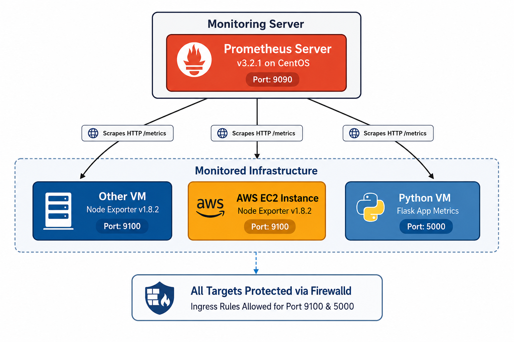
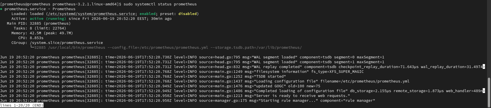
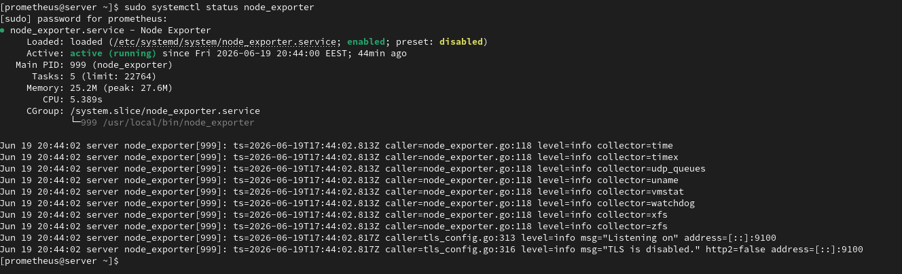
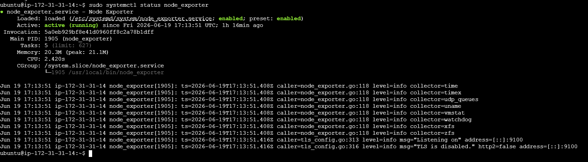
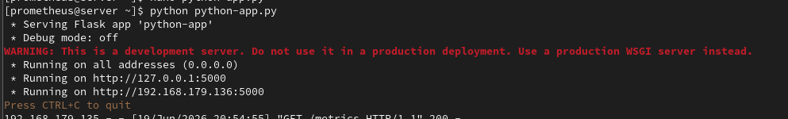
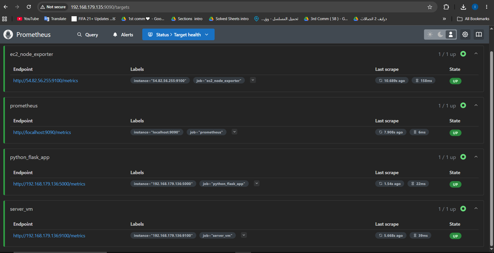

# 🛠️ Enterprise Installation, Configuration, and Environment Validation of Prometheus 

## 📋 Comprehensive Lab Guide: End-to-End Infrastructure & Application Monitoring on CentOS

<p align="left">
  
  
  
  
  
</p>

---

## 🗺️ System Architecture

This lab demonstrates an enterprise-grade, pull-based monitoring system architecture. The centralized Prometheus instance scrapes system-level and application-level metrics across multiple isolated environments (On-Premise CentOS VMs and Cloud AWS EC2 instances).
<p align="center">
  
  <br>
  <em><b>Figure 1:</b> System Architecture Diagram </em>
</p>

---

## 🛠️ Infrastructure & Tools Matrix

| Tool | Version | Default Port | Role in Architecture |
| --- | --- | --- | --- |
| **Prometheus** | v3.2.1 (Stable Release) | `9090` | Centralized time-series database & scraping engine |
| **Node Exporter** | v1.8.2 | `9100` | Machine metrics collector (CPU, Memory, Disk, Network) |
| **Python / Flask** | Custom App | `5000` | Simulated microservice exposing custom HTTP counters |
| **Firewalld (CentOS)** | Native | — | Secure perimeter control managing port ingress/egress |

---

## 🚀 Server-by-Server Deployment Guide

### 1️⃣ Server A: Prometheus Core Server (Central Engine)

#### A. Pre-requisites & User Provisioning

Create a dedicated system user account without login shells (`/sbin/nologin`) to safely isolate the Prometheus service process execution context.

```bash
# Ensure download utilities are available
sudo dnf install -y wget tar

# Create system account
sudo useradd --no-create-home --shell /sbin/nologin prometheusservice

# Prepare standard system directories
sudo mkdir /etc/prometheus
sudo mkdir /var/lib/prometheus

```

#### B. Installation & Storage Setup

Download and unpack the stable v3.2.1 components. Note that legacy console folders (`consoles`/`console_libraries`) are removed in recent modern updates.

```bash
cd /tmp
wget [https://github.com/prometheus/prometheus/releases/download/v3.2.1/prometheus-3.2.1.linux-amd64.tar.gz](https://github.com/prometheus/prometheus/releases/download/v3.2.1/prometheus-3.2.1.linux-amd64.tar.gz)
tar -xvf prometheus-3.2.1.linux-amd64.tar.gz
cd prometheus-3.2.1.linux-amd64

# Move binary files to local executable paths
sudo cp prometheus /usr/local/bin/
sudo cp promtool /usr/local/bin/
sudo cp prometheus.yml /etc/prometheus/

# Adjust Ownership Permissions
sudo chown -R prometheusservice:prometheusservice /etc/prometheus /var/lib/prometheus
sudo chown prometheusservice:prometheusservice /usr/local/bin/prometheus
sudo chown prometheusservice:prometheusservice /usr/local/bin/promtool

```

#### C. Systemd Service Configuration

Configure a native systemd unit file at `/etc/systemd/system/prometheus.service`:

```ini
[Unit]
Description=Prometheus
Wants=network-online.target
After=network-online.target

[Service]
User=prometheusservice
Group=prometheusservice
Type=simple
ExecStart=/usr/local/bin/prometheus \
    --config.file=/etc/prometheus/prometheus.yml \
    --storage.tsdb.path=/var/lib/prometheus/

[Install]
WantedBy=multi-user.target

```

#### D. Networking & Service Activation

```bash
# Enable Firewalld rule for dashboard web UI accessibility
sudo firewall-cmd --permanent --add-port=9090/tcp
sudo firewall-cmd --reload

# Reload daemon and run service
sudo systemctl daemon-reload
sudo systemctl start prometheus
sudo systemctl enable prometheus

```

#### 📸 Verification Checklist

* Run `sudo systemctl status prometheus` to check active operational status.

<p align="center">
  
  <br>
  <em><b>Figure 2: </b> Prometheus Status Check </em>
</p>

---

### 2️⃣ Server B & C: Node Exporter Implementation (Other VM & AWS EC2)

*Execute these configuration commands on BOTH targeted compute nodes.*

#### A. User Provisioning & Binary Installation

```bash
# Secure execution context
sudo useradd --no-create-home --shell /sbin/nologin node_exporter

# Fetch Node Exporter binary bundle
cd /tmp
wget [https://github.com/prometheus/node_exporter/releases/download/v1.8.2/node_exporter-1.8.2.linux-amd64.tar.gz](https://github.com/prometheus/node_exporter/releases/download/v1.8.2/node_exporter-1.8.2.linux-amd64.tar.gz)
tar -xvf node_exporter-1.8.2.linux-amd64.tar.gz
cd node_exporter-1.8.2.linux-amd64

# Move executables and assign ownership
sudo cp node_exporter /usr/local/bin/
sudo chown node_exporter:node_exporter /usr/local/bin/node_exporter

```

#### B. Systemd Daemon Deployment

Create the system unit descriptor file at `/etc/systemd/system/node_exporter.service`:

```ini
[Unit]
Description=Node Exporter
Wants=network-online.target
After=network-online.target

[Service]
User=node_exporter
Group=node_exporter
Type=simple
ExecStart=/usr/local/bin/node_exporter

[Install]
WantedBy=multi-user.target

```

#### C. Network Integration

```bash
# Adjust Firewalld rules for scraper ingress
sudo firewall-cmd --permanent --add-port=9100/tcp
sudo firewall-cmd --reload

# Fire systemd unit
sudo systemctl daemon-reload
sudo systemctl start node_exporter
sudo systemctl enable node_exporter

```

> ⚠️ **AWS Cloud Network Note:** Ensure the AWS EC2 instance's Security Group allows inbound TCP traffic on port `9100` restricted to the Prometheus Server IP.

#### 📸 Verification Checklist

* Run `sudo systemctl status node_exporter` on both nodes.
  
<p align="center">
  
  <br>
  <em><b>Figure 3:</b> Node Exporter Status Check On Other VM </em>
</p>

<p align="center">
  
  <br>
  <em><b>Figure 4:</b> Node Exporter Status Check On EC2 Instance </em>
</p>

---

### 3️⃣ Server D: Python Instrumented Application

#### A. Python Dependency Resolution

```bash
sudo dnf install -y python3 python3-pip
pip3 install flask prometheus_client

```
#### B. Application Configuration 
```bash
sudo nano python-app.py
```
```ini
from flask import Flask, Response
from prometheus_client import Counter, generate_latest, CONTENT_TYPE_LATEST

app = Flask(__name__)

requests_total = Counter(
    'app_requests_total',
    'Total requests'
)

@app.route('/')
def home():
    requests_total.inc()
    return "Hello ITI to python app with prometheus monitoring"


@app.route('/metrics')
def metrics():
    return Response(
        generate_latest(),
        mimetype=CONTENT_TYPE_LATEST
    )


if __name__ == '__main__':
    app.run(host='0.0.0.0', port=5000)
```

#### C. Activating Application 

```bash
sudo firewall-cmd --permanent --add-port=5000/tcp
sudo firewall-cmd --reload

#run the application 
python python-app.py

```

#### 📸 Verification Checklist

* Run `python python-app.py` to ensure application availability.

<p align="center">
  
  <br>
  <em><b>Figure 5:</b> Application Run Verify</em>
</p>

---

## 🔗 Central Configuration Wiring (`prometheus.yml`)

Update `/etc/prometheus/prometheus.yml` on your central Prometheus Server to point directly to your multi-node topology:

```yaml
global:
  scrape_interval: 15s # Set the scrape interval to every 15 seconds. Default is every 1 minute.
  evaluation_interval: 15s # Evaluate rules every 15 seconds. The default is every 1 minute.
  # scrape_timeout is set to the global default (10s).

# Alertmanager configuration
alerting:
  alertmanagers:
    - static_configs:
        - targets:
          # - alertmanager:9093

# Load rules once and periodically evaluate them according to the global 'evaluation_interval'.
rule_files:
  # - "first_rules.yml"
  # - "second_rules.yml"

# A scrape configuration containing exactly one endpoint to scrape:
# Here it's Prometheus itself.
scrape_configs:
  # The job name is added as a label `job=<job_name>` to any timeseries scraped from this config.
  - job_name: "prometheus"

    # metrics_path defaults to '/metrics'
    # scheme defaults to 'http'.

    static_configs:
      - targets: ["localhost:9090"]

  - job_name: 'server_vm'
    static_configs:
      - targets: ['<IP_OF_OTHER_VM>:9100']

  - job_name: 'python_flask_app'
    static_configs:
      - targets: ['<IP_OF_PYTHON_APP_VM>:5000']

  - job_name: 'ec2_node_exporter'
    static_configs:
      - targets: ['<PUBLIC_OR_PRIVATE_IP_OF_EC2>:9100']

```

Apply modifications smoothly:

```bash
sudo systemctl restart prometheus

```

#### 📸 Final Validation Verification

* Navigate to `http://<PROMETHEUS_SERVER_IP>:9090/targets` via browser.

<p align="center">
  
  <br>
  <em><b>Figure 6:</b> Prometheus Dashboard Verify </em>
</p>

---

## 📝 Project Summary

This enterprise architecture simulation demonstrates a secure and production-ready monitoring ecosystem leveraging Prometheus v3 on CentOS Linux.

### Key Accomplishments:

* **Secured System Access Control:** Isolated all system daemons using minimal privileges (`/sbin/nologin` users), ensuring strong process isolation.
* **Network Infrastructure Security:** Configured explicit ingress port configurations using native `firewalld` filtering mechanisms along with public cloud security groups.
* **Multi-Environment Aggregation:** Combined multi-source hardware footprints (On-Prem VMs + Cloud instances) alongside native app context tracking into a standardized telemetry control interface.
---
**Developed by:** [Eslam Harpy](https://github.com/EslamHarpy)
*Infrastructure & DevOps Engineer*

