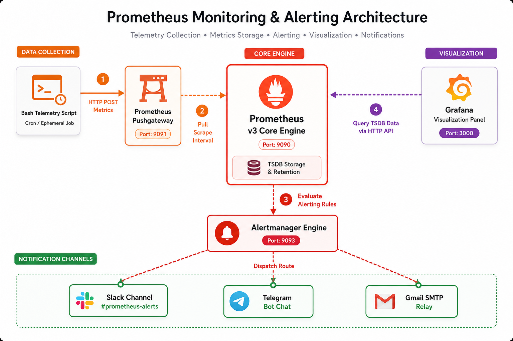
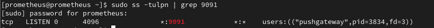
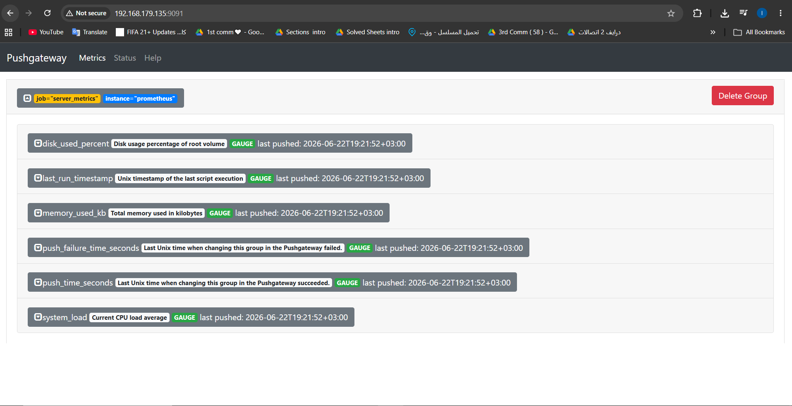
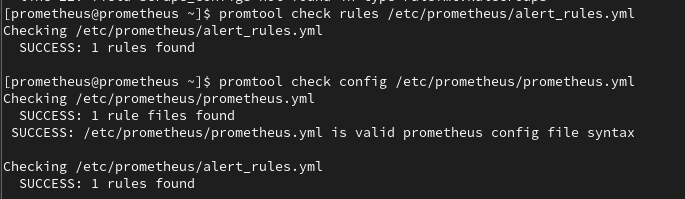
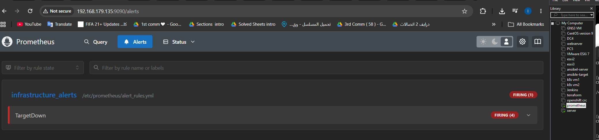
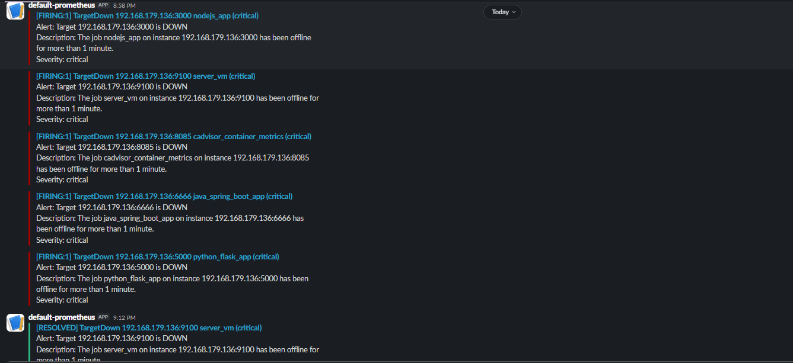
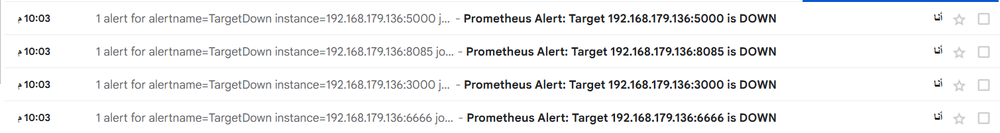
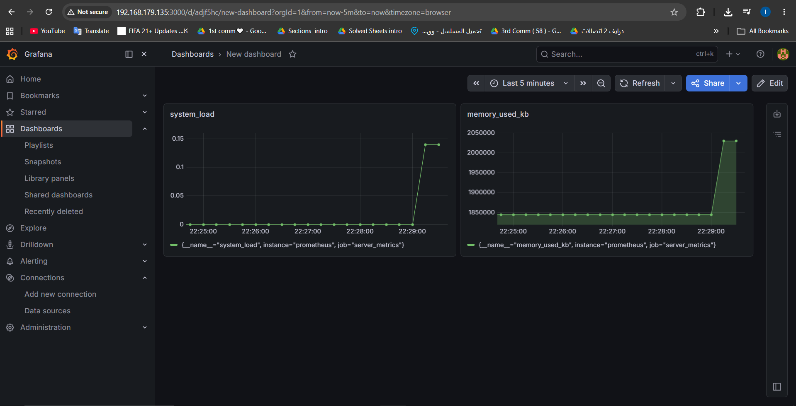

# 🛠️ Enterprise Implementation of Push-Based Architecture, Multi-Channel Alerting, and Grafana Visualization

## 📋 Comprehensive Lab Guide: Pushgateway, Alertmanager (Slack, Telegram, Gmail), and Grafana Stack on CentOS

<p align="left">
  
  
  
  
  
  
</p>

---

## 🗺️ System Architecture

This lab demonstrates an advanced hybrid monitoring framework combining traditional **Pull-based** telemetry with modern **Push-based** metric collection for ephemeral or batch jobs. It features a complete centralized engine routing metric storage to **Grafana** dashboards and active alerts to multiple enterprise communication clusters.

<p align="center">
  
  <br>
  <em><b>Figure 1:</b> System Architecture Diagram </em>
</p>

---

## 🛠️ Infrastructure & Tools Matrix

| Tool | Version | Default Port | Network Bind | Role in Architecture |
| --- | --- | --- | --- | --- |
| **Pushgateway** | v1.9.0 | `9091` | `0.0.0.0` (All Interfaces) | Accepts and caches ephemeral batch metrics via HTTP POST |
| **Alertmanager** | v0.27.0 | `9093` | `0.0.0.0` (All Interfaces) | Deduplicates, groups, and routes active alerts to dispatch channels |
| **Grafana** | v11.x (Latest) | `3000` | `0.0.0.0` (All Interfaces) | Connects to TSDB endpoints to build production analytics grids |
| **Bash Engine** | Native | — | Local execution | Extracting dynamic `/proc` and storage telemetry payloads |

---

## 🔑 Notification Gateways Setup & Credentials Provisioning

Before configuring the Alertmanager deployment, credentials and secure webhooks must be engineered across all communication providers.

### 1️⃣ Telegram Bot API Setup

1. Open Telegram and search for the official **`@BotFather`**.
2. Initiate configuration by sending the command: `/newbot`.
3. Follow prompts to assign a name and a unique username. Secure the generated **HTTP API Bot Token** (e.g., `7123456789:ABCdefGh...`).
4. Search for the **`@userinfobot`** or **`@GetIDBot`** and trigger `/start` to retrieve your unique numerical **Telegram Chat ID** (e.g., `987654321`).
5. **Crucial Step:** Open a direct message chat with your newly created bot and click **`/start`** to white-list communication.

### 2️⃣ Slack Webhook Architecture Setup

1. Navigate to your corporate Slack Workspace and build a new public channel named `#prometheus-alerts`.
2. Go to the [Slack API Core Console](https://api.slack.com/apps) and click **Create New App** -> Select **From scratch**.
3. Under Features, select **Incoming Webhooks** and toggle the switch to **Activate**.
4. Click **Add New Webhook to Workspace**, authorize access, and map it specifically to the `#prometheus-alerts` channel.
5. Secure the generated long-form **Webhook URL Engine Link** (e.g., `https://hooks.slack.com/services/T.../B.../X...`).

### 3️⃣ Gmail Secure SMTP Relay Setup

Because modern mail providers reject plain-text credential handling, App Passwords must be issued:

1. Log into your Google Account Security Dashboard.
2. Ensure **2-Step Verification** is fully activated across your primary domain identity.
3. Access the **App Passwords** configuration area.
4. Select **Other (Custom Name)**, title the entry as `Prometheus-Alertmanager`, and click **Generate**.
5. Temporarily capture the unique **16-character App Password Key** (Ensure all embedded spacing is omitted during deployment).

---

## 🚀 Step-by-Step Implementation Guide

### 1️⃣ Phase 1: Pushgateway Installation & Metric Injection

#### A. User Provisioning & Isolation

```bash
sudo useradd --no-create-home --shell /sbin/nologin pushgateway

```

#### B. Binary Installation & Setup

```bash
cd /tmp
wget [https://github.com/prometheus/pushgateway/releases/download/v1.9.0/pushgateway-1.9.0.linux-amd64.tar.gz](https://github.com/prometheus/pushgateway/releases/download/v1.9.0/pushgateway-1.9.0.linux-amd64.tar.gz)
tar -xvf pushgateway-1.9.0.linux-amd64.tar.gz
cd pushgateway-1.9.0.linux-amd64

sudo cp pushgateway /usr/local/bin/
sudo chown pushgateway:pushgateway /usr/local/bin/pushgateway

```

#### C. Systemd Service Integration (Enforcing Network-Wide Bind)

To enable external metrics injection via remote network devices, the daemon must bind onto `0.0.0.0:9091`. Configure `/etc/systemd/system/pushgateway.service`:

```ini
[Unit]
Description=Prometheus Pushgateway
Wants=network-online.target
After=network-online.target

[Service]
User=pushgateway
Group=pushgateway
Type=simple
ExecStart=/usr/local/bin/pushgateway --web.listen-address=0.0.0.0:9091

[Install]
WantedBy=multi-user.target

```

```bash
sudo systemctl daemon-reload
sudo systemctl start pushgateway
sudo systemctl enable pushgateway

sudo firewall-cmd --permenent --zone=public --add-port=9091/tcp
sudo firewall-cmd --reload
```

#### 📸 Verification Checklist (Pushgateway Core)

* Run network port tracking to verify universal interface availability:

```bash
sudo ss -tulpn | grep 9091
# Expected output must match: LISTEN 0 0.0.0.0:9091

```
<p align="center">
  
  <br>
  <em><b>Figure 2:</b> Push-Gatway Port Verify </em>
</p>

* Validate raw local web engine functionality:

```bash
curl http://localhost:9091/metrics

```

<p align="center">
  
  <br>
  <em><b>Figure 2:</b> Push-Gatway Port Verify </em>
</p>

#### D. Production-Grade Telemetry Injection Script

Build an autonomous shell metrics aggregator at `~/push-gw/script-pushgw.sh`:

```bash
#!/bin/bash

PUSHGW="[http://192.168.179.135:9091](http://192.168.179.135:9091)"
JOB="server_metrics"
INSTANCE=$(hostname)

CPU_LOAD=$(awk '{print $1}' /proc/loadavg)
MEM_USED=$(free | awk '/Mem:/ {print $3}')
DISK_USED=$(df / | awk 'NR==2 {gsub("%",""); print $5}')
TIMESTAMP=$(date +%s)

cat <<METRICS # ### #### ${CPU_LOAD} ${DISK_USED} ${MEM_USED} ${PUSHGW}/metrics/job/${JOB}/instance/${INSTANCE} ${TIMESTAMP} & '<SENDER_ACCOUNT 'disk_used_percent' 'memory_used_kb', 'smtp.gmail.com:587' 'system_load', (Alertmanager (Metric (Slack, * +x --- --config.file="/etc/alertmanager/alertmanager.yml" --data-binary --no-create-home --shell --silent --storage.path="/var/lib/alertmanager/" -R -xvf /etc/alertmanager /etc/alertmanager/ /sbin/nologin /tmp /usr/local/bin/ /usr/local/bin/alertmanager /usr/local/bin/amtool /var/lib/alertmanager 2: 2️⃣ 3: 3️⃣ 5m @- A. Access After="network-online.target" Aggregation) Alertmanager B. Binary CPU Central Checklist Clean Configuration Confirm Core Current Dashboard Description="Prometheus" Disk Environment ExecStart="/usr/local/bin/alertmanager" Fetch Gmail) Group="alertmanager" HELP IP Implementation Integration) METRICS Modify Multi-Channel Notification Phase Placements Provision Receiver Routing Run Service Setup Systemd TYPE Telegram Telegram, Topology Total Type="simple" Unix User="alertmanager" Verification WantedBy="multi-user.target" Wants="network-online.target" [Install] [Service] [Unit] `/etc/alertmanager/alertmanager.yml` `/etc/systemd/system/alertmanager.service`: ``` ```bash ```ini ```yaml `[http://192.168.179.135:9093](http://192.168.179.135:9093)` across active alertmanager alertmanager-0.27.0.linux-amd64 alertmanager-0.27.0.linux-amd64.tar.gz alertmanager.yml alertmanager:alertmanager amtool and are average bottom cd channel chmod chown clean consistent cp curl daemon-reload data disk_used_percent enable engine execution external gateways: gauge global: host [http://192.168.179.135:9091/metrics](http://192.168.179.135:9091/metrics) [https://github.com/prometheus/alertmanager/releases/download/v0.27.0/alertmanager-0.27.0.linux-amd64.tar.gz](https://github.com/prometheus/alertmanager/releases/download/v0.27.0/alertmanager-0.27.0.linux-amd64.tar.gz) in ingestion: integrations. kilobytes last last_run_timestamp load locally maintain memory memory_used_kb metrics mkdir of operation: parser percentage plain populate resolve_timeout: root routing rows. script smtp_from: smtp_smarthost: specify start state status structures sudo system_load systemctl tar text the timestamp to tool: tracking under usage used useradd verification verify via volume wget | ~/push-gw/script-pushgw.sh 📸>@gmail.com' smtp_auth_username: '<SENDER_ACCOUNT>@gmail.com' smtp_auth_password: '<16_DIGIT_GOOGLE_APP_PASSWORD>' smtp_require_tls: true smtp_hello: 'localhost' route: group_by: ['alertname', 'instance', 'job'] group_wait: 10s group_interval: repeat_interval: 1h receiver: 'multi_channel_receiver' receivers: - name: slack_configs: api_url: '<SLACK_WEBHOOK_INBOUND_URL>' channel: '#prometheus-alerts' send_resolved: text: "Alert: {{ .CommonAnnotations.summary }}\nDescription: .CommonAnnotations.description }}\nSeverity: .CommonLabels.severity }}" telegram_configs: bot_token: '<TELEGRAM_BOT_HTTP_API_TOKEN>' chat_id: <TELEGRAM_RAW_CHAT_ID_WITHOUT_QUOTES>
        send_resolved: true
        message: "Alert Status: {{ .Status }}\nSummary: {{ .CommonAnnotations.summary }}\nDescription: {{ .CommonAnnotations.description }}\nSeverity: {{ .CommonLabels.severity }}"

    email_configs:
      - to: '<TARGET_RECEIVER_EMAIL>'
        send_resolved: true
        headers:
          subject: 'Prometheus Notification: {{ .CommonAnnotations.summary }}'

```

```bash
sudo systemctl restart alertmanager

```
* Validate raw local web engine functionality:

```init

 http://localhost:9091/metrics

```

<p align="center">
  
  <br>
  <em><b>Figure 3:</b> Push-Gatway Dashboard Verify </em>
</p>
---

### 4️⃣ Phase 4: Prometheus Target & Rule Wiring

#### A. Defining Infrastructure Watchdog Rules

Configure automated server state infrastructure rules at `/etc/prometheus/alert_rules.yml`:

```yaml
groups:
  - name: infrastructure_alerts
    rules:
      - alert: TargetDown
        expr: up == 0
        for: 1m
        labels:
          severity: critical
        annotations:
          summary: "Target {{ $labels.instance }} is DOWN"
          description: "The job {{ $labels.job }} on instance {{ $labels.instance }} has been offline for more than 1 minute."

```

#### B. Main Prometheus Configuration Integration

Modify `/etc/prometheus/prometheus.yml` to stitch alert rule bindings and the Pushgateway endpoint together:

```yaml
rule_files:
  - "/etc/prometheus/alert_rules.yml"

alerting:
  alertmanagers:
    - static_configs:
        - targets:
            - localhost:9093

scrape_configs:
  - job_name: "prometheus"
    static_configs:
      - targets: ["localhost:9090"]

  - job_name: 'pushgateway'
    honor_labels: true
    static_configs:
      - targets: ['localhost:9091']

```

```bash
sudo systemctl restart prometheus

```

#### 📸 Verification Checklist (Validation & Alerts Simulation)

* Validate Prometheus configuration using native diagnostics tools:

```bash
promtool check config /etc/prometheus/prometheus.yml
promtool check rules /etc/prometheus/alert_rules.yml

```
<p align="center">
  
  <br>
  <em><b>Figure 4:</b> Configurations Files Verify   </em>
</p>

* **Simulate Production Failure:** Connect to a monitored endpoint node and terminate its Node Exporter instance:

```bash
sudo systemctl stop node_exporter

```

* Navigate to `http://192.168.179.135:9090/alerts`. Observe the `TargetDown` lifecycle transition from `Pending` (yellow) to `Firing` (red) after 60 seconds.
* Confirm immediate, synchronized message receipt across Slack, Telegram, and Gmail.
<p align="center">
  
  <br>
  <em><b>Figure 5:</b> Alert Dashboard   </em>
</p>
<p align="center">
  
  <br>
  <em><b>Figure 6:</b> Telegram Alerts   </em>
</p>
<p align="center">
  
  <br>
  <em><b>Figure 7:</b> Slack Alerts  </em>
</p>
<p align="center">
  
  <br>
  <em><b>Figure 8:</b> Gmail Alerts   </em>
</p>
---

### 5️⃣ Phase 5: Enterprise Analytics Dashboard Installation (Grafana)

#### A. Secure Production Repository Placement

Create the repository mapping file at `/etc/yum.repos.d/grafana.repo`:

```ini
[grafana]
name=grafana
baseurl=[https://rpm.grafana.com](https://rpm.grafana.com)
repo_gpgcheck=1
enabled=1
gpgcheck=1
gpgkey=[https://rpm.grafana.com/gpg.key](https://rpm.grafana.com/gpg.key)
sslverify=1
sslcacert=/etc/pki/tls/certs/ca-bundle.crt

```

#### B. Installation & Service Activation

```bash
sudo dnf install -y grafana
sudo systemctl daemon-reload
sudo systemctl start grafana-server
sudo systemctl enable grafana-server

```

#### C. Data Source Setup & Panel Design

1. Access the web dashboard console at `http://192.168.179.135:3000` (Initial Credentials: `admin` / `admin`).
2. Navigate to **Connections** -> **Data Sources** -> Click **Add Data Source** -> Select **Prometheus**.
3. Set the internal connection URL endpoint to: `http://localhost:9090`. Click **Save & Test** to verify connectivity.
4. Create a production tracking view dashboard named **"Server Pushgateway Metrics"** by structuring custom visualization blocks using native PromQL variables:
* **CPU Performance Panel:** `system_load`
* **Memory Saturation Panel:** `memory_used_kb`
* **Root Volume Analytics Panel:** `disk_used_percent`


#### 📸 Verification Checklist (Grafana Control Layer)

* Confirm that the Data Source connectivity test yields a successful green response.
* Verify that your customized panels accurately display the metrics pushed by your background automation script.

<p align="center">
  
  <br>
  <em><b>Figure 9:</b> Grafana Dashboard  </em>
</p>
---

## 📝 Project Summary & Critical Engineering Takeaways

### Key Accomplishments:

* **Decoupled Telemetry Ingestion:** Engineered an automated, high-fidelity push framework utilizing Prometheus Pushgateway for custom scripts without violating raw scraping standards.
* **Network Interface Resolution:** Successfully resolved localized loopback interface connection constraints by shifting binds across all active daemon units safely to `0.0.0.0`.
* **Synchronized Multi-Channel Alert Dispatching:** Implemented an orchestrated routing layer simultaneously delivering precise notifications over corporate chat apps (Slack), consumer gateways (Telegram Bot API), and secure mail protocols (Gmail SMTP Relay).
* **Unified Telemetry Control Room:** Combined bare-metal metrics, database endpoints, and batch scripting values under a centralized Grafana analytics system.

---

**Developed by:** [Eslam Harpy](https://github.com/EslamHarpy)

*Infrastructure & DevOps Engineer*
